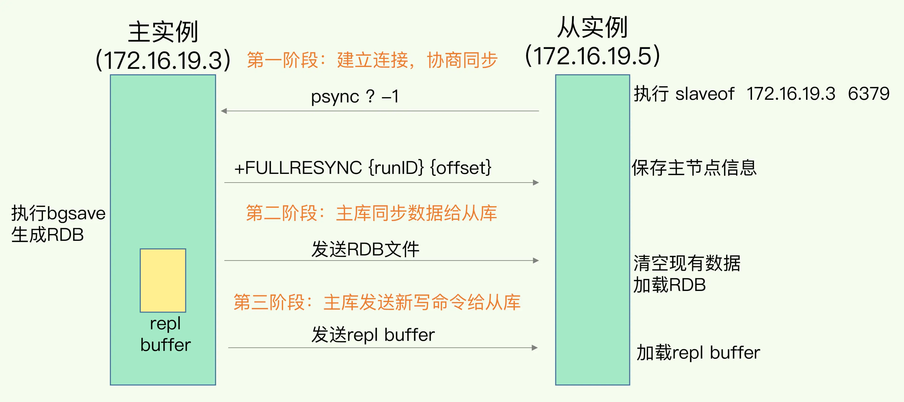
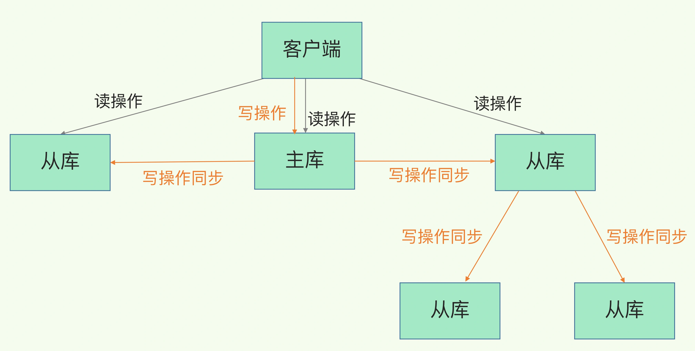
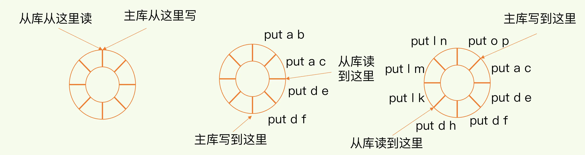
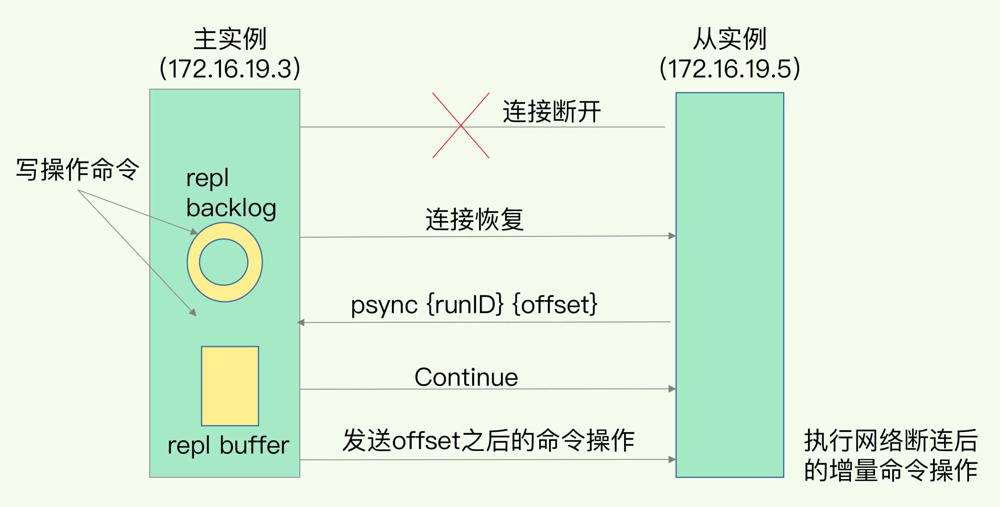

# 数据同步：主从库如何实现数据一致？

## 1. 概述

Redis 具有高可靠性，又是什么意思呢？其实，这里有两层含义：

* 一是**数据尽量少丢失**，
* 二是**服务尽量少中断**。

AOF 和 RDB 保证了前者，而对于后者，Redis 的做法就是**增加副本冗余量**，将一份数据同时保存在多个实例上。即使有一个实例出现了故障，需要过一段时间才能恢复，其他实例也可以对外提供服务，不会影响业务使用。

*这么多副本，它们之间的数据如何保持一致呢？*

Redis 提供了主从库模式，以保证数据副本的一致，主从库之间采用的是**读写分离**的方式。

* **读操作**：主库、从库都可以接收；
* **写操作**：首先到主库执行，然后，主库将写操作同步给从库。

*为什么要采用读写分离的方式呢？*

不让 从库 接收写操作，主要是为了保证数据一致性。如果 从库 可以接收写操作，那么每次写请求都可能会发送到不同的实例上，要保持数据在三个实例上一致，就要涉及到加锁、实例间协商是否完成修改等一系列操作，但这会带来巨额的开销，当然是不太能接受的。

而主从库模式一旦采用了读写分离，所有数据的修改只会在主库上进行，不用协调三个实例。主库有了最新的数据后，会同步给从库，这样，主从库的数据就是一致的。

## 2. 同步过程

当我们启动多个 Redis 实例的时候，它们相互之间就可以通过 replicaof（Redis 5.0 之前使用 slaveof）命令形成主库和从库的关系，之后会按照三个阶段完成数据的第一次同步。

* 1）建立连接，协商同步
* 2）主库同步数据给从库
* 3）主库发送新写命令给从库

**第一阶段**是主从库间建立连接、协商同步的过程，主要是为全量复制做准备。在这一步，**从库和主库建立起连接，并告诉主库即将进行同步，主库确认回复后，主从库间就可以开始同步了**。

具体来说，从库给主库发送 psync 命令，表示要进行数据同步，主库根据这个命令的参数来启动复制。psync 命令包含了**主库的 runID** 和**复制进度 offset** 两个参数。

* runID，是每个 Redis 实例启动时都会自动生成的一个随机 ID，用来唯一标记这个实例。当从库和主库第一次复制时，因为不知道主库的 runID，所以将 runID 设为“？”。
* offset，此时设为 -1，表示第一次复制。

主库收到 psync 命令后，会用 FULLRESYNC 响应命令带上两个参数：主库 runID 和主库目前的复制进度 offset，返回给从库。从库收到响应后，会记录下这两个参数。

这里有个地方需要注意，**FULLRESYNC 响应表示第一次复制采用的全量复制，也就是说，主库会把当前所有的数据都复制给从库**。

**第二阶段**，**主库将所有数据同步给从库。从库收到数据后，在本地完成数据加载**。这个过程依赖于内存快照生成的 RDB 文件。

具体来说，主库执行 bgsave 命令，生成 RDB 文件，接着将文件发给从库。从库接收到 RDB 文件后，会先清空当前数据库，然后加载 RDB 文件。

> 这是因为从库在通过 replicaof 命令开始和主库同步前，可能保存了其他数据。为了避免之前数据的影响，从库需要先把当前数据库清空。

因为在主库将数据同步给从库的过程中，主库仍然可以正常接收请求，为了保证主从库的数据一致性，主库会在内存中用专门的 replication buffer，记录 RDB 文件生成后收到的所有写操作。

**第三阶段**，主库会把第二阶段执行过程中新收到的写命令，再发送给从库。具体的操作是，当主库完成 RDB 文件发送后，就会把此时 replication buffer 中的修改操作发给从库，从库再重新执行这些操作。这样一来，主从库就实现同步了。

那么，一旦主从库完成了全量复制，它们之间就会一直维护一个网络连接，主库会通过这个连接将后续陆续收到的命令操作再同步给从库，这个过程也称为**基于长连接的命令传播**，可以避免频繁建立连接的开销。

## 3. 主从级联模式分担全量复制时的主库压力

一次全量复制中，对于主库来说，需要完成两个耗时的操作：生成 RDB 文件和传输 RDB 文件。

如果从库数量很多，而且都要和主库进行全量复制的话，就会导致主库忙于 fork 子进程生成 RDB 文件，进行数据全量同步

我们可以**通过“主 - 从 - 从”模式将主库生成 RDB 和传输 RDB 的压力，以级联的方式分散到从库上**。

简单来说，我们在部署主从集群的时候，可以手动选择一个从库（比如选择内存资源配置较高的从库），用于级联其他的从库。然后，我们可以再选择一些从库（例如三分之一的从库），在这些从库上执行如下命令，让它们和刚才所选的从库，建立起主从关系。

> 将某个从库作为 `伪主库`，替主库分担主从复制的压力。

## 4. 主从库间网络断了怎么办？

在 Redis 2.8 之前，如果主从库在命令传播时出现了网络闪断，那么，从库就会和主库重新进行一次全量复制，开销非常大。

从 Redis 2.8 开始，网络断了之后，主从库会采用增量复制的方式继续同步，即把主从库网络断连期间主库收到的命令，同步给从库。

在有从库存在的时候 Redis 会把接收到的操作命令写入 repl_backlog_buffer 这个缓冲区。

> 主库只有一个 repl_backlog_buffer ，相当于是所有从库共用，然后每个从库记录自己的 slave_repl_offset 。

repl_backlog_buffer 是一个环形缓冲区，**主库会记录自己写到的位置，从库则会记录自己已经读到的位置**。

刚开始的时候，主库和从库的写读位置在一起，这算是它们的起始位置。随着主库不断接收新的写操作，它在缓冲区中的写位置会逐步偏离起始位置，我们通常用偏移量来衡量这个偏移距离的大小，对主库来说，对应的偏移量就是 master_repl_offset。主库接收的新写操作越多，这个值就会越大。

同样，从库在复制完写操作命令后，它在缓冲区中的读位置也开始逐步偏移刚才的起始位置，此时，从库已复制的偏移量 slave_repl_offset 也在不断增加。正常情况下，这两个偏移量基本相等。

主从库的连接恢复之后，从库首先会给主库发送 psync 命令，并把自己当前的 slave_repl_offset 发给主库，主库会判断自己的 master_repl_offset 和 slave_repl_offset 之间的差距。然后，主库只用把 master_repl_offset 和 slave_repl_offset 之间的命令操作同步给从库就行。

因为 repl_backlog_buffer 是一个环形缓冲区，所以在缓冲区写满后，主库会继续写入，此时，就会覆盖掉之前写入的操作。如果从库的读取速度比较慢，就有可能导致从库还未读取的操作被主库新写的操作覆盖了，这会导致主从库间的数据不一致。

> 如果出现这种情况，Redis 为了保证数据一致性，又会触发主从库全量复制。

一般而言，我们可以调整 repl_backlog_size 这个参数。这个参数和所需的缓冲空间大小有关。缓冲空间的计算公式是：缓冲空间大小 = 主库写入命令速度 * 操作大小 - 主从库间网络传输命令速度 * 操作大小。在实际应用中，考虑到可能存在一些突发的请求压力，我们通常需要把这个缓冲空间扩大一倍，即 repl_backlog_size = 缓冲空间大小 * 2，这也就是 repl_backlog_size 的最终值。

## 5. 小结

* 1）Redis 的主从库同步有三种模式：全量复制、基于长连接的命令传播，以及增量复制。
* 2）全量复制很耗时而且对于从库来说，如果是第一次同步，全量复制是无法避免的

建议

* 1）**一个 Redis 实例的数据库不要太大**，一个实例大小在几 GB 级别比较合适，这样可以减少 RDB 文件生成、传输和重新加载的开销。
* 2）也可以采用“主 - 从 - 从”这一级联模式，来缓解主库的压力。
* 3）设置调大 repl_backlog_size 参数，可以减少从库在网络断连时全量复制的风险

AOF 记录的操作命令更全，相比于 RDB 丢失的数据更少。那么，为什么主从库间的复制不使用 AOF 呢？

* 1）文件小

RDB文件内容是经过压缩的二进制数据（不同数据类型数据做了针对性优化），文件很小。而AOF文件记录的是每一次写操作的命令，写操作越多文件会变得很大，其中还包括很多对同一个key的多次冗余操作

* 2）恢复快

RDB文件存储的都是二进制数据，从库直接按照RDB协议解析还原数据即可，速度会非常快，而AOF需要依次重放每个写命令，这个过程会经历冗长的处理逻辑，恢复速度相比RDB会慢得多

* 3）影响性能

使用AOF做全量同步，意味着必须打开AOF功能，文件刷盘的策略，选择不当会严重影响Redis性能

而RDB只有在需要定时备份和主从全量同步数据时才会触发生成一次快照

在很多丢失数据不敏感的业务场景，其实是不需要开启AOF的