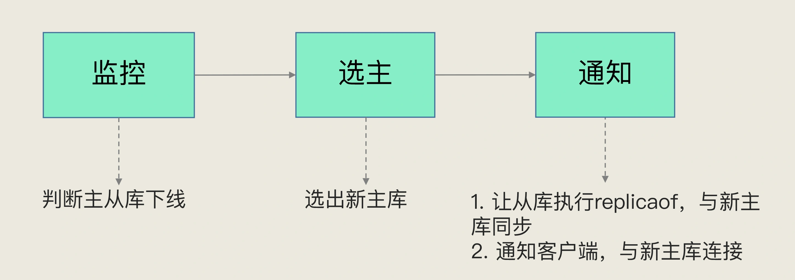

# 哨兵机制

## 1. 概述

在主从模式下，如果从库发生故障了，客户端可以继续向主库或其他从库发送请求，进行相关的操作。

但是如果主库发生故障了，那就直接会影响到从库的同步，因为从库没有相应的主库可以进行数据复制操作了。

而且主从库模式下的读写分离要求，需要由主库来完成写操作。

所以，如果主库挂了，我们就需要运行一个新主库，比如说把一个从库切换为主库，把它当成主库。

这就涉及到三个问题：

* 主库真的挂了吗？
* 该选择哪个从库作为主库？
* 怎么把新主库的相关信息通知给从库和客户端呢？

**哨兵机制**就是用于解决这些问题的，在 Redis 主从集群中，哨兵机制是实现主从库自动切换的关键机制，它有效地解决了主从复制模式下故障转移的这三个问题。

## 2. 哨兵机制的基本流程

哨兵其实就是一个运行在特殊模式下的 Redis 进程，主从库实例运行的同时，它也在运行。哨兵主要负责的就是三个任务：监控、选主（选择主库）和通知。

**监控**

监控是指哨兵进程在运行时，**周期性地给所有的主从库发送 PING 命令**，检测它们是否仍然在线运行。如果从库没有在规定时间内响应哨兵的 PING 命令，哨兵就会把它标记为“下线状态”；同样，如果主库也没有在规定时间内响应哨兵的 PING 命令，哨兵就会判定主库下线，然后开始**自动切换主库**的流程。

**选主**

主库挂了以后，哨兵就需要从很多个从库里，按照一定的规则选择一个从库实例，把它作为新的主库。这一步完成后，现在的集群里就有了新主库。

**通知**

选主之后哨兵会把新主库的连接信息发给其他从库，让它们执行 replicaof 命令，和新主库建立连接，并进行数据复制。同时，哨兵会把新主库的连接信息通知给客户端，让它们把请求操作发到新主库上。

* 在监控任务中，哨兵需要判断主库是否处于下线状态；
* 在选主任务中，哨兵也要决定选择哪个从库实例作为主库。

## 3. 主观下线和客观下线

哨兵对主库的下线判断有“主观下线”和“客观下线”两种。

**哨兵进程会使用 PING 命令检测它自己和主、从库的网络连接情况，用来判断实例的状态**。如果哨兵发现主库或从库对 PING 命令的响应超时了，那么，哨兵就会先把它标记为“主观下线”。

* 如果检测的是从库，那么，哨兵简单地把它标记为“主观下线”就行了，因为从库的下线影响一般不太大，集群的对外服务不会间断。
* 如果检测的是主库，那么，哨兵还不能简单地把它标记为“主观下线”，开启主从切换。因为主从切换开销比较大，如果是哨兵误判了，其实主库并没有故障，那就会影响集群性能。

为了避免误判，**通常会采用多实例组成的集群模式进行部署，这也被称为哨兵集群**。引入多个哨兵实例一起来判断，就可以避免单个哨兵因为自身网络状况不好，而误判主库下线的情况

只有大多数的哨兵实例，都判断主库已经“主观下线”了，主库才会被标记为“客观下线”。这个判断原则就是：少数服从多数。

简单来说，“客观下线”的标准就是，当有 N 个哨兵实例时，最好要有 N/2 + 1 个实例判断主库为“主观下线”，才能最终判定主库为“客观下线”。这样一来，就可以减少误判的概率，也能避免误判带来的无谓的主从库切换。

> 当然，有多少个实例做出“主观下线”的判断才可以，可以由 Redis 管理员自行设定。

## 4. 选主

哨兵选择新主库的过程可以分为“筛选 + 打分”两个环节。

> Kubernetes 中 Pod 调度时也和这个流程类似。

们在多个从库中，先按照一定的筛选条件，把不符合条件的从库去掉。然后，我们再按照一定的规则，给剩下的从库逐个打分，将得分最高的从库选为新主库。

**筛选条件**

* 1）检查从库的当前在线状态
  * 如果当前从库都不在线肯定不能做主库
* 2）判断从库之前的网络连接状态
  * 如果之前从库经常掉线，说明网络不稳定，也不适合做主库

**打分算法**

按照三个规则依次进行三轮打分，这三个规则分别是**从库优先级、从库复制进度以及从库 ID 号**。

> 只要在某一轮中，有从库得分最高，那么它就是主库了，选主过程到此结束。

* 第一轮：优先级最高的从库得分高。
  * 用户可以通过 slave-priority 配置项，给不同的从库设置不同优先级。
  * 比如可以把配置好的从库优先级调高
* 第二轮：和旧主库同步程度最接近的从库得分高。
  * master_repl_offset 和 slave_repl_offset 两个值分别记录了主从库最新的操作
  * 主库挂了获取不到 master_repl_offset 所以只能用 slave_repl_offset 了
  * slave_repl_offset 越大得分就越高
* 第三轮：ID 号小的从库得分高
  * 在优先级和复制进度都相同的情况下，ID 号最小的从库得分最高，会被选为新主库。
  * 这是一个兜底规则，保证一定能选出主库。

## 5. 小结

* 1）哨兵机制能在主库发生故障时，自动的进行主从切换，是服务不间断的关键支撑。
* 2）哨兵机制通过以下三大功能实现自动主从切换
  * 监控主库运行状态，并判断主库是否客观下线；
  * 在主库客观下线后，选取新主库；
  * 选出新主库后，通知从库和客户端。
* 3）哨兵集群降低误判率