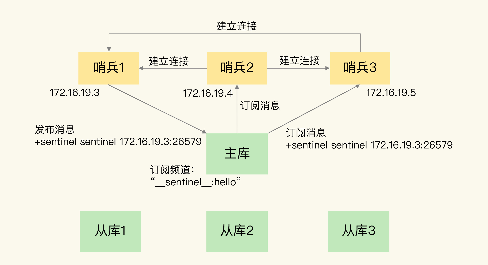
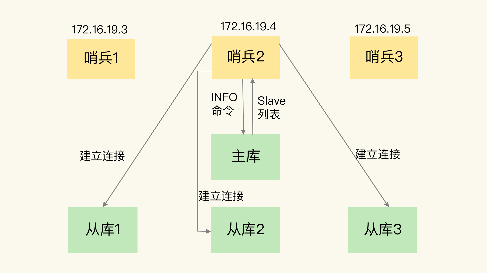
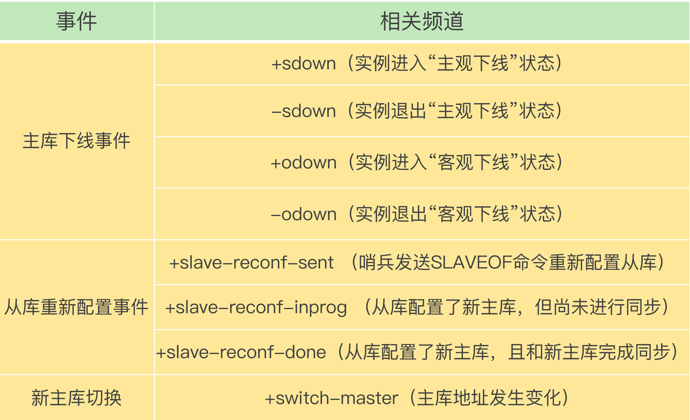
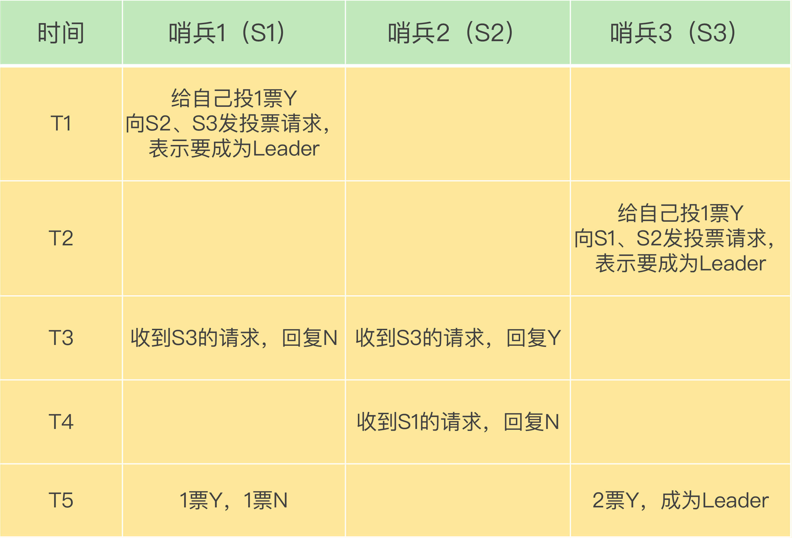

# 哨兵集群

## 1. 概述

一旦多个实例组成了哨兵集群，即使有哨兵实例出现故障挂掉了，其他哨兵还能继续协作完成主从库切换的工作，包括判定主库是不是处于下线状态，选择新主库，以及通知从库和客户端。

部署过哨兵集群只需要用到下面的这个配置项，设置主库的 IP 和端口即可：

```sh
sentinel monitor <master-name> <ip> <redis-port> <quorum> 
```

*这些哨兵实例既然都不知道彼此的地址，又是怎么组成集群的呢？*


## 2. 基于 pub/sub 机制的哨兵集群组成

哨兵实例之间可以相互发现，要归功于 Redis 提供的 pub/sub 机制，也就是发布 / 订阅机制。

**哨兵们通过订阅了同一个频道的应用，通过发布的消息进行信息交换。**

在主从集群中，主库上有一个名为`__sentinel__:hello`频道，不同哨兵就是通过它来相互发现，实现互相通信的。


在下图中，哨兵 1 把自己的 IP（172.16.19.3）和端口（26579）发布到“__sentinel__:hello”频道上，哨兵 2 和 3 订阅了该频道。那么此时，哨兵 2 和 3 就可以从这个频道直接获取哨兵 1 的 IP 地址和端口号。

然后，哨兵 2、3 可以和哨兵 1 建立网络连接。通过这个方式，哨兵 2 和 3 也可以建立网络连接，这样一来，哨兵集群就形成了。它们相互间可以通过网络连接进行通信，比如说对主库有没有下线这件事儿进行判断和协商。



哨兵除了彼此之间建立起连接形成集群外，还需要和从库建立连接。这是因为，在哨兵的监控任务中，它需要对主从库都进行心跳判断，而且在主从库切换完成后，它还需要通知从库，让它们和新主库进行同步。


*哨兵是如何知道从库的 IP 地址和端口的呢？*

这是由哨兵向主库发送 INFO 命令来完成的。就像下图所示，哨兵 2 给主库发送 INFO 命令，主库接受到这个命令后，就会把从库列表返回给哨兵。接着，哨兵就可以根据从库列表中的连接信息，和每个从库建立连接，并在这个连接上持续地对从库进行监控。哨兵 1 和 3 可以通过相同的方法和从库建立连接。



通过 pub/sub 机制，哨兵之间可以组成集群，同时，哨兵又通过 INFO 命令，获得了从库连接信息，也能和从库建立连接，并进行监控了。

除此之外，哨兵还需要和客户端交互，进行数据同步。


## 3. 基于 pub/sub 机制的客户端事件通知

从本质上说，哨兵就是一个运行在特定模式下的 Redis 实例，只不过它并不服务请求操作，只是完成监控、选主和通知的任务。

所以，每个哨兵实例也提供 pub/sub 机制，客户端可以从哨兵订阅消息。


哨兵提供的消息订阅频道有很多，不同频道包含了主从库切换过程中的不同关键事件,几个关键频道如下：



知道了这些频道之后，你就可以让**客户端从哨兵这里订阅消息**了。具体的操作步骤是，客户端读取哨兵的配置文件后，可以获得哨兵的地址和端口，和哨兵建立网络连接。然后，我们可以在客户端执行订阅命令，来获取不同的事件消息。

有了这些事件通知，客户端不仅可以在主从切换后得到新主库的连接信息，还可以监控到主从库切换过程中发生的各个重要事件。这样，客户端就可以知道主从切换进行到哪一步了，有助于了解切换进度。


## 4. 由哪个哨兵执行主从切换？

确定由哪个哨兵执行主从切换的过程，和主库“客观下线”的判断过程类似，也是一个**投票仲裁**的过程。

任何一个实例只要自身判断主库“主观下线”后，就会给其他实例发送 is-master-down-by-addr 命令。接着，其他实例会根据自己和主库的连接情况，做出 Y 或 N 的响应，Y 相当于赞成票，N 相当于反对票。

任何一个哨兵获得了仲裁所需的赞成票数(包括自己的一张)后，就可以标记主库为“客观下线”。这个所需的赞成票数是通过哨兵配置文件中的 quorum 配置项设定的。

> 例如，现在有 5 个哨兵，quorum 配置的是 3，那么，一个哨兵需要 3 张赞成票，就可以标记主库为“客观下线”了。这 3 张赞成票包括哨兵自己的一张赞成票和另外两个哨兵的赞成票。


在投票过程中，任何一个想成为 Leader 的哨兵，要满足两个条件：第一，拿到半数以上的赞成票；第二，拿到的票数同时还需要大于等于哨兵配置文件中的 quorum 值。

> 在分布式系统中 quorum 值主要用于防止脑裂。




在 T1 时刻，S1 判断主库为“客观下线”，它想成为 Leader，就先给自己投一张赞成票，然后分别向 S2 和 S3 发送命令，表示要成为 Leader。

在 T2 时刻，S3 判断主库为“客观下线”，它也想成为 Leader，所以也先给自己投一张赞成票，再分别向 S1 和 S2 发送命令，表示要成为 Leader。

在 T3 时刻，S1 收到了 S3 的 Leader 投票请求。因为 S1 已经给自己投了一票 Y，所以它不能再给其他哨兵投赞成票了，所以 S1 回复 N 表示不同意。同时，S2 收到了 T2 时 S3 发送的 Leader 投票请求。因为 S2 之前没有投过票，它会给第一个向它发送投票请求的哨兵回复 Y，给后续再发送投票请求的哨兵回复 N，所以，在 T3 时，S2 回复 S3，同意 S3 成为 Leader。

在 T4 时刻，S2 才收到 T1 时 S1 发送的投票命令。因为 S2 已经在 T3 时同意了 S3 的投票请求，此时，S2 给 S1 回复 N，表示不同意 S1 成为 Leader。发生这种情况，是因为 S3 和 S2 之间的网络传输正常，而 S1 和 S2 之间的网络传输可能正好拥塞了，导致投票请求传输慢了。

最后，在 T5 时刻，S1 得到的票数是来自它自己的一票 Y 和来自 S2 的一票 N。而 S3 除了自己的赞成票 Y 以外，还收到了来自 S2 的一票 Y。此时，S3 不仅获得了半数以上的 Leader 赞成票，也达到预设的 quorum 值（quorum 为 2），所以它最终成为了 Leader。接着，S3 会开始执行选主操作，而且在选定新主库后，会给其他从库和客户端通知新主库的信息。

如果 S3 没有拿到 2 票 Y，那么这轮投票就不会产生 Leader。哨兵集群会等待一段时间（也就是哨兵故障转移超时时间的 2 倍），再重新选举。这是因为，哨兵集群能够进行成功投票，很大程度上依赖于选举命令的正常网络传播。如果网络压力较大或有短时堵塞，就可能导致没有一个哨兵能拿到半数以上的赞成票。所以，等到网络拥塞好转之后，再进行投票选举，成功的概率就会增加。

> 需要注意的是，如果哨兵集群只有 2 个实例，此时，一个哨兵要想成为 Leader，还是要获得预设的quorum 值 2 票，而不是 1 票。


## 5. 小结

* 1）哨兵集群组成主要依赖pub/sub 机制
* 2）基于 INFO 命令的从库列表，这可以帮助哨兵和从库建立连接；
* 3）基于哨兵自身的 pub/sub 功能，这实现了客户端和哨兵之间的事件通知。
* 4）经过投票仲裁，选举一个 Leader 出来，由它负责实际的主从切换，即由它来完成新主库的选择以及通知从库与客户端。

建议

**要保证所有哨兵实例的配置是一致的，尤其是主观下线的判断值 down-after-milliseconds**