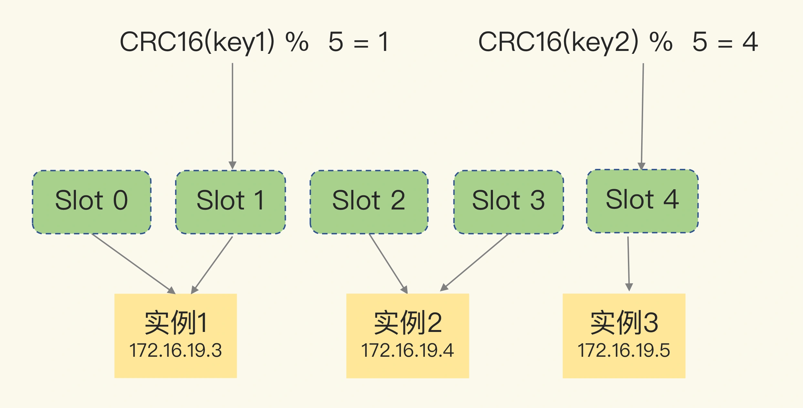
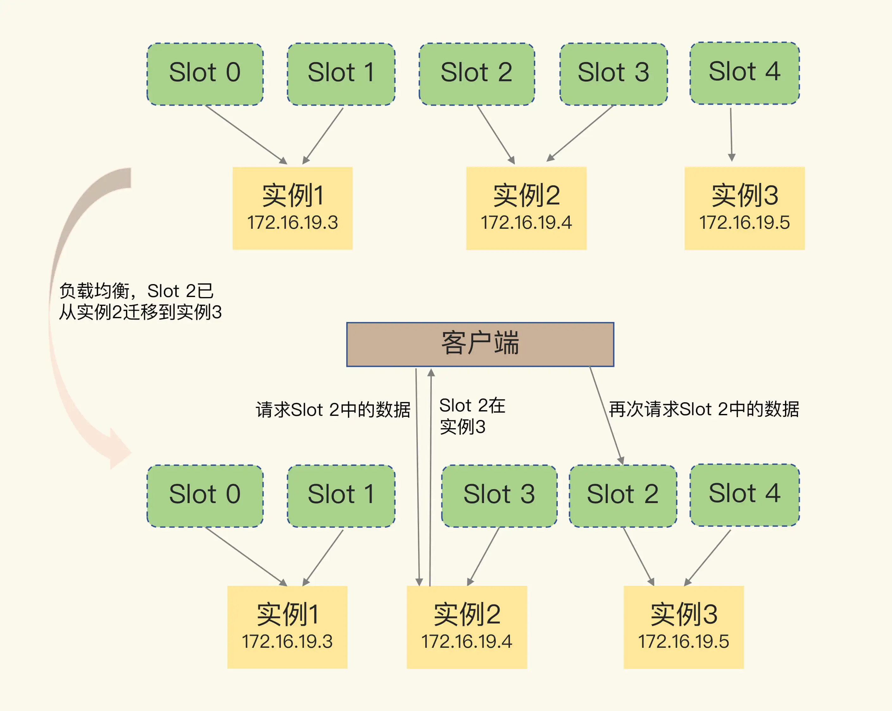
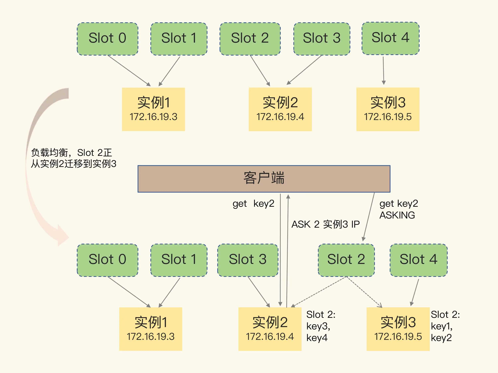

# 切片集群

## 1. 概述

假如有这么一个需求：要用 Redis 保存 5000 万个键值对，每个键值对大约是 512B，为了能快速部署并对外提供服务，我们采用云主机来运行 Redis 实例，那么，该如何选择云主机的内存容量呢？

这些键值对所占的内存空间大约是 25GB（5000 万 *512B）。所以，当时，我想到的第一个方案就是：选择一台 32GB 内存的云主机来部署 Redis。因为 32GB 的内存能保存所有数据，而且还留有 7GB，可以保证系统的正常运行。同时，我还采用 RDB 对数据做持久化，以确保 Redis 实例故障后，还能从 RDB 恢复数据。

是，在使用的过程中，我发现，Redis 的响应有时会非常慢。后来，我们使用 INFO 命令查看 Redis 的 latest_fork_usec 指标值（表示最近一次 fork 的耗时），结果显示这个指标值特别高，快到秒级别了。

在使用 RDB 进行持久化时，Redis 会 fork 子进程来完成，fork 操作的用时和 Redis 的数据量是正相关的，而 fork 在执行时会阻塞主线程。数据量越大，fork 操作造成的主线程阻塞的时间越长。

超大数据对 Redis RDB 快照造成了极大压力，在生成 RDB 快照时会严重影响集群性能。

Redis 切片集群就是用来解决这种超大实例问题的。

**切片集群，也叫分片集群，就是指启动多个 Redis 实例组成一个集群，然后按照一定的规则，把收到的数据划分成多份，每一份用一个实例来保存**。

回到我们刚刚的场景中，如果把 25GB 的数据平均分成 5 份（当然，也可以不做均分），使用 5 个实例来保存，每个实例只需要保存 5GB 数据。

那么，在切片集群中，实例在为 5GB 数据生成 RDB 时，数据量就小了很多，fork 子进程一般不会给主线程带来较长时间的阻塞。采用多个实例保存数据切片后，我们既能保存 25GB 数据，又避免了 fork 子进程阻塞主线程而导致的响应突然变慢。

在实际应用 Redis 时，随着用户或业务规模的扩展，保存大量数据的情况通常是无法避免的。而切片集群，就是一个非常好的解决方案。这节课，我们就来学习一下。


## 2. 如何存储更多数据

* **纵向扩展( scale up)**：升级单个 Redis 实例的资源配置，包括增加内存容量、增加磁盘容量、使用更高配置的 CPU。
  * 优点：实施起来简单、直接。
  * 缺点1：当使用 RDB 对数据进行持久化时，如果数据量增加，需要的内存也会增加，主线程 fork 子进程时就可能会阻塞
  * 缺点2：**纵向扩展会受到硬件和成本的限制**，硬件存在上限，不能无限扩展。

* **横向扩展( scale out)**：增加 Redis 实例的个数。
  * 优点：扩展性更好


**在面向百万、千万级别的用户规模时，横向扩展的 Redis 切片集群会是一个非常好的选择。**


## 3. 数据切片和实例的对应分布关系

切片集群是一种保存大量数据的通用机制，这个机制可以有不同的实现方案。

从 3.0 开始，官方提供了一个名为 Redis Cluster 的方案，用于实现切片集群。


Redis Cluster 方案中就规定了数据和实例的对应规则。具体来说，**Redis Cluster 方案采用哈希槽（Hash Slot，接下来我会直接称之为 Slot），来处理数据和实例之间的映射关系**。

在 Redis Cluster 方案中，一个切片集群共有 16384 个哈希槽，这些哈希槽类似于数据分区，每个键值对都会根据它的 key，被映射到一个哈希槽中。

具体的映射过程分为两大步：

* 1）首先根据键值对的 key 找到 哈希槽 solt

根据键值对的 key 按照CRC16 算法计算一个 16 bit 的值；然后，再用这个 16bit 值对 16384 取模，得到 0~16383 范围内的模数，每个模数代表一个相应编号的哈希槽。


* 2）然后根据 solt 找到对应节点。

使用 cluster create 命令创建集群时 Redis 会自动把这些槽平均分布在集群实例上。

> 如果集群中有 N 个实例，那么，每个实例上的槽个数为 16384/N 个。

当然也可以使用 cluster addslots 命令根据实例配置自定义分配哈希槽。

第一步找到对应的 slot 之后就可以根据 实例和 slot 的映射关系找到对应实例。




注意：**在手动分配哈希槽时，需要把 16384 个槽都分配完，否则 Redis 集群无法正常工作**。


## 4. 客户端如何定位数据？

**信息扩散**

集群刚刚创建的时候，每个实例只知道自己被分配了哪些哈希槽，是不知道其他实例拥有的哈希槽信息的。

为了完成哈希槽分配信息的扩散 Redis 实例会把自己的哈希槽信息发给和它相连接的其它实例。当实例之间相互连接后，每个实例就有所有哈希槽的映射关系了。

**客户端缓存**

客户端和集群实例建立连接后，实例就会把哈希槽的分配信息发给客户端。

客户端收到哈希槽信息后，会把哈希槽信息缓存在本地。当客户端请求键值对时，会先计算键所对应的哈希槽，然后就可以给相应的实例发送请求了。


### 重定向机制

但是，在集群中，实例和哈希槽的对应关系并不是一成不变的，最常见的变化有两个：

* 在集群中，实例有新增或删除，Redis 需要重新分配哈希槽；
* 为了负载均衡，Redis 需要把哈希槽在所有实例上重新分布一遍。

此时，实例之间还可以通过相互传递消息，获得最新的哈希槽分配信息，但是，客户端是无法主动感知这些变化的。这就会导致，它缓存的分配信息和最新的分配信息就不一致了。

Redis Cluster 方案提供了一种**重定向机制**，类似于 HTTP 中的重定向。


### MOVED

当客户端把一个键值对的操作请求发给一个实例时，如果这个实例上并没有这个键值对映射的哈希槽，那么，这个实例就会给客户端返回下面的 MOVED 命令响应结果，这个结果中就包含了新实例的访问地址。

```sh
GET hello:key
(error) MOVED 13320 172.16.19.5:6379
```

响应结果表示：客户端请求的键值对所在的哈希槽 13320，实际是在 172.16.19.5 这个实例上。

这样一来，客户端就可以直接和 172.16.19.5 连接，并发送操作请求了。

**MOVED 命令会更新客户端缓存的哈希槽分配信息，可以理解为 HTTP 中的 302 永久重定向。**





### ASK

实际应用时，如果 Slot 2 中的数据比较多，就可能会出现一种情况：客户端向实例 2 发送请求，但此时，Slot 2 中的数据只有一部分迁移到了实例 3，还有部分数据没有迁移。在这种迁移部分完成的情况下，客户端就会收到一条 ASK 报错信息，如下所示：

> 实例2会先查询自己这边确实没有这个key才会返回ASK，如果有就直接返回 value 了。

```sh
GET hello:key
(error) ASK 13320 172.16.19.5:6379
```

这个结果中的 ASK 命令就表示，客户端请求的键值对所在的哈希槽 13320，在 172.16.19.5 这个实例上，但是这个哈希槽正在迁移。此时，客户端需要先给 172.16.19.5 这个实例发送一个 ASKING 命令。这个命令的意思是，让这个实例允许执行客户端接下来发送的命令。然后，客户端再向这个实例发送 GET 命令，以读取数据。


在下图中，Slot 2 正在从实例 2 往实例 3 迁移，key1 和 key2 已经迁移过去，key3 和 key4 还在实例 2。客户端向实例 2 请求 key2 后，就会收到实例 2 返回的 ASK 命令。

ASK 命令表示两层含义：第一，表明 Slot 数据还在迁移中；第二，ASK 命令把客户端所请求数据的最新实例地址返回给客户端，此时，客户端需要给实例 3 发送 ASKING 命令，然后再发送操作命令。



和 MOVED 命令不同，**ASK 命令并不会更新客户端缓存的哈希槽分配信息，可以理解为 HTTP 中的 301 临时重定向。**

所以，在上图中，如果客户端再次请求 Slot 2 中的数据，它还是会给实例 2 发送请求。


## 5. 小结

* 1）Redis Cluster 即官方的 切片集群解决方案，通过将数据分散到 16384 个 slot中，然后为集群中每个实例分配一部分 slot，从而实现将数据分散到多个实例。
* 2）根据 key 找到对应 solt，然后找到对应实例。
  * slot = crc16(key) % 16384
  * slot 和实例之间的映射关系会在集群中进行同步，客户端也会自己缓存。
* 3）重定向机制
  * MOVED = HTTP 302 永久重定向
  * ASK = HTTP 301 临时重定向

FAQ

Redis Cluster 通过 Key 的 CRC16 值来计算哈希槽，再根据哈希槽找到对应的实例，为什么不直接记录 Key 和实例的对应关系？这样就不用每次计算 CRC16 值了。

* 1.整个集群存储key的数量是无法预估的，key的数量非常多时，直接记录每个key对应的实例映射关系，这个映射表会非常庞大，这个映射表无论是存储在服务端还是客户端都占用了非常大的内存空间。
* 2.Redis Cluster采用无中心化的模式（无proxy，客户端与服务端直连），客户端在某个节点访问一个key，如果这个key不在这个节点上，这个节点需要有纠正客户端路由到正确节点的能力（MOVED响应），这就需要节点之间互相交换路由表，每个节点拥有整个集群完整的路由关系。如果存储的都是key与实例的对应关系，节点之间交换信息也会变得非常庞大，消耗过多的网络资源，而且就算交换完成，相当于每个节点都需要额外存储其他节点的路由表，内存占用过大造成资源浪费
* 3.当集群在扩容、缩容、数据均衡时，节点之间会发生数据迁移，迁移时需要修改每个key的映射关系，维护成本高。
* 4.而在中间增加一层哈希槽，可以把数据和节点解耦，key通过Hash计算，只需要关心映射到了哪个哈希槽，然后再通过哈希槽和节点的映射表找到节点，相当于消耗了很少的CPU资源，不但让数据分布更均匀，还可以让这个映射表变得很小，利于客户端和服务端保存，节点之间交换信息时也变得轻量
* 5.当集群在扩容、缩容、数据均衡时，节点之间的操作例如数据迁移，都以哈希槽为基本单位进行操作，简化了节点扩容、缩容的难度，便于集群的维护和管理。


