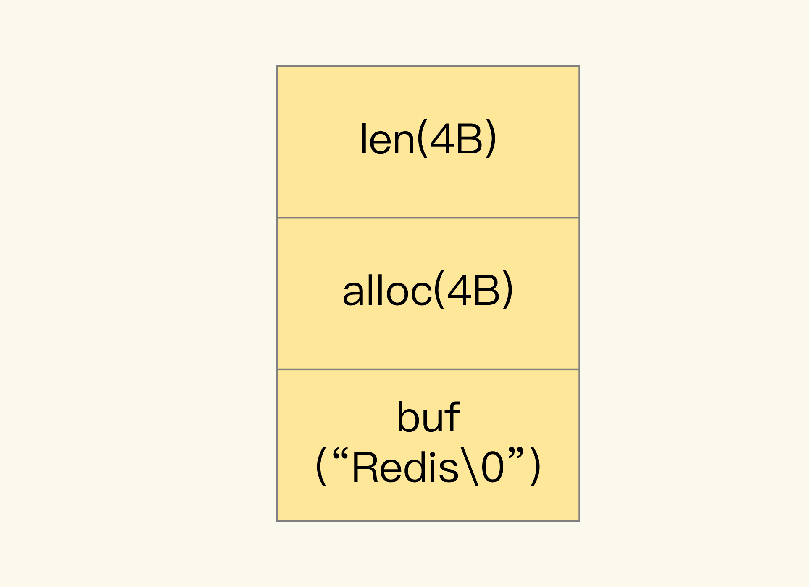
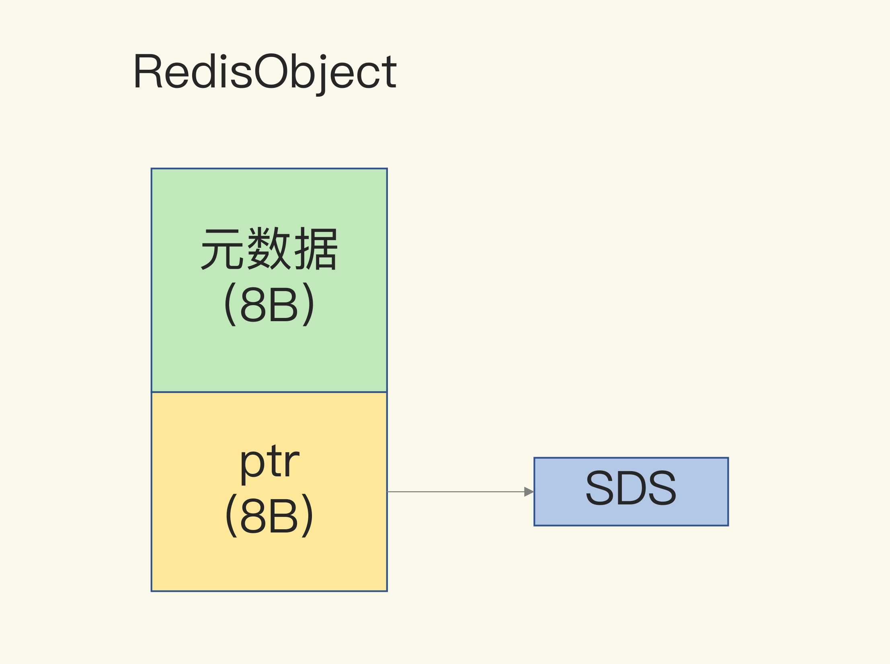
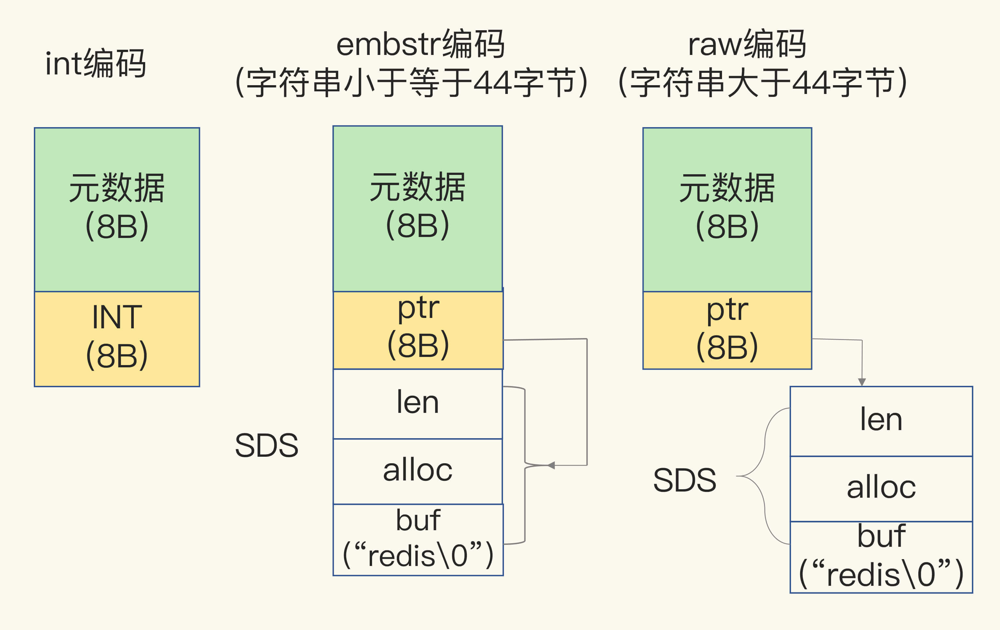
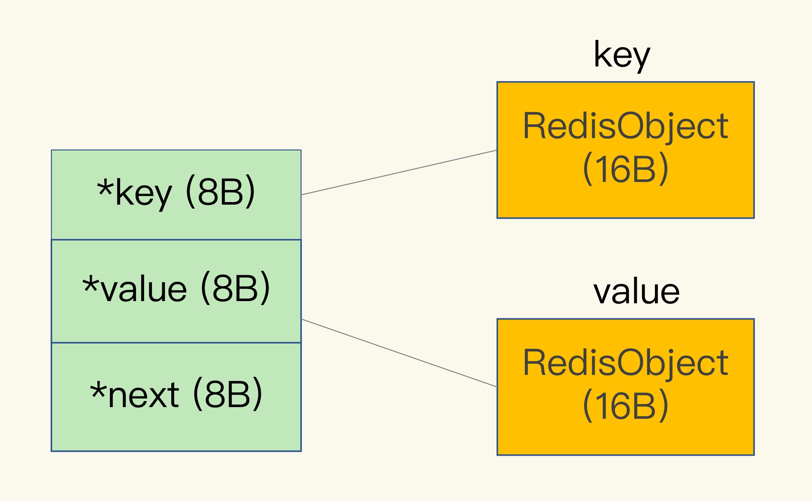

# String

## 1. 概述

需求：开发一个图片存储系统，要求这个系统能快速地记录图片 ID 和图片在存储系统中保存时的 ID（可以直接叫作图片存储对象 ID）。同时，还要能够根据图片 ID 快速查找到图片存储对象 ID。

因为图片数量巨大，所以我们就用 10 位数来表示图片 ID 和图片存储对象 ID，例如，图片 ID 为 1101000051，它在存储系统中对应的 ID 号是 3301000051。

图片 ID 和图片存储对象 ID 正好一一对应，是典型的“键 - 单值”模式，很容易想到使用 String 来存储。

刚开始，我们保存了 1 亿张图片，大约用了 6.4GB 的内存。但是，随着图片数据量的不断增加，我们的 Redis 内存使用量也在增加，结果就遇到了大内存 Redis 实例因为生成 RDB 而响应变慢的问题。很显然，String 类型并不是一种好的选择，我们还需要进一步寻找能节省内存开销的数据类型方案。

最后得出的结论是：

String 类型并不是适用于所有场合的，它有一个明显的短板，就是它**保存数据时所消耗的内存空间较多**。

## 2. 为什么 String 类型内存开销大？

在刚才的案例中，我们保存了 1 亿张图片的信息，用了约 6.4GB 的内存，一个图片 ID 和图片存储对象 ID 的记录平均用了 64 字节。

**除了记录实际数据，String 类型还需要额外的内存空间记录数据长度、空间使用等信息，这些信息也叫作元数据**。

当实际保存的数据较小时，元数据的空间开销就显得比较大了，有点“喧宾夺主”的意思。

当你保存 64 位有符号整数时，String 类型会把它保存为一个 8 字节的 Long 类型整数，这种保存方式通常也叫作 int 编码方式。

### SDS

但是，当你保存的数据中包含字符时，String 类型就会用简单动态字符串（Simple Dynamic String，SDS）结构体来保存，如下图所示：

* **buf**：字节数组，保存实际数据。为了表示字节数组的结束，Redis 会自动在数组最后加一个“\0”，这就会额外占用 1 个字节的开销。
* **len**：占 4 个字节，表示 buf 的已用长度。
* **alloc**：也占个 4 字节，表示 buf 的实际分配长度，一般大于 len。

> 可以看到，在 SDS 中，buf 保存实际数据，而 len 和 alloc 本身其实是 SDS 结构体的额外开销。

### RedisObject

另外，对于 String 类型来说，除了 SDS 的额外开销，还有一个来自于 RedisObject 结构体的开销。

因为 Redis 的数据类型有很多，而且，不同数据类型都有些相同的元数据要记录（比如最后一次访问的时间、被引用的次数等），所以，**Redis 会用一个 RedisObject 结构体来统一记录这些元数据**，同时指向实际数据。

一个 RedisObject 包含了 8 字节的元数据和一个 8 字节指针，这个指针再进一步指向具体数据类型的实际数据所在，例如指向 String 类型的 SDS 结构所在的内存地址，可以看一下下面的示意图。

为了节省内存空间，Redis 还对 Long 类型整数和 SDS 的内存布局做了专门的设计。

一方面，当保存的是 Long 类型整数时，RedisObject 中的指针就直接赋值为整数数据了，这样就不用额外的指针再指向整数了，节省了指针的空间开销。这种布局方式也被称为 int 编码方式。

> 8 字节刚好可以存下 Long 类型整数。

另一方面，当保存的是字符串数据，并且字符串小于等于 44 字节时，RedisObject 中的元数据、指针和 SDS 是一块连续的内存区域，这样就可以避免内存碎片。这种布局方式也被称为 embstr 编码方式。

当然，当字符串大于 44 字节时，SDS 的数据量就开始变多了，Redis 就不再把 SDS 和 RedisObject 布局在一起了，而是会给 SDS 分配独立的空间，并用指针指向 SDS 结构。这种布局方式被称为 raw 编码模式。

### dictEntry 

，Redis 会使用一个全局哈希表保存所有键值对，哈希表的每一项是一个 dictEntry 的结构体，用来指向一个键值对。dictEntry 结构中有三个 8 字节的指针，分别指向 key、value 以及下一个 dictEntry，三个指针共 24 字节，如下图所示：

虽然只占了 24 字节，但是Redis 的内存分配库 jemalloc 在分配内存时，会根据我们申请的字节数 N，找一个比 N 大，但是最接近 N 的 2 的幂次数作为分配的空间，这样可以减少频繁分配的次数。

> 如果你申请 6 字节空间，jemalloc 实际会分配 8 字节空间；如果你申请 24 字节空间，jemalloc 则会分配 32 字节。

所以，在我们刚刚说的场景里，dictEntry 结构就占用了 32 字节。

String 占用的 64 字节分别是 dictEntry(32字节) + Key(16字节) + Value(16字节)。

> 明明有效信息只有 16 字节，使用 String 类型保存时，却需要 64 字节的内存空间。

## 3. 用什么数据结构可以节省内存？

Redis 有一种底层数据结构，叫压缩列表（ziplist），这是一种非常节省内存的结构。

表头有三个字段 zlbytes、zltail 和 zllen，分别表示列表长度、列表尾的偏移量，以及列表中的 entry 个数。压缩列表尾还有一个 zlend，表示列表结束。

压缩列表之所以能节省内存，就在于它是用一系列连续的 entry 保存数据。每个 entry 的元数据包括下面几部分。

* **prev_len**：表示前一个 entry 的长度。prev_len 有两种取值情况：1 字节或 5 字节。取值 1 字节时，表示上一个 entry 的长度小于 254 字节。虽然 1 字节的值能表示的数值范围是 0 到 255，但是压缩列表中 zlend 的取值默认是 255，因此，就默认用 255 表示整个压缩列表的结束，其他表示长度的地方就不能再用 255 这个值了。所以，当上一个 entry 长度小于 254 字节时，prev_len 取值为 1 字节，否则，就取值为 5 字节。
* **len**：表示自身长度，4 字节；
* **encoding**：表示编码方式，1 字节；
* **content**：保存实际数据。

这些 entry 会挨个儿放置在内存中，不需要再用额外的指针进行连接，这样就可以节省指针所占用的空间。

我们以保存图片存储对象 ID 为例，来分析一下压缩列表是如何节省内存空间的：

每个 entry 保存一个图片存储对象 ID（8 字节），此时，每个 entry 的 prev_len 只需要 1 个字节就行，因为每个 entry 的前一个 entry 长度都只有 8 字节，小于 254 字节。这样一来，一个图片的存储对象 ID 所占用的内存大小是 14 字节（1+4+1+8=14），实际分配 16 字节。

**Redis 基于压缩列表实现了 List、Hash 和 Sorted Set 这样的集合类型，这样做的最大好处就是节省了 dictEntry 的开销**。

> 当你用 String 类型时，一个键值对就有一个 dictEntry，要用 32 字节空间。但采用集合类型时，一个 key 就对应一个集合的数据，能保存的数据多了很多，但也只用了一个 dictEntry，这样就节省了内存。

但是问题来了，在一个键对应一个值（也就是单值键值对）的情况下，我们该怎么用集合类型来保存这种单值键值对呢？

## 4. 如何用集合类型保存单值的键值对？

**在保存单值的键值对时，可以采用基于 Hash 类型的二级编码方法**。

这里说的二级编码，就是把一个单值的数据拆分成两部分，前一部分作为 Hash 集合的 key，后一部分作为 Hash 集合的 field 和 value，这样一来，我们就可以把单值数据保存到 Hash 集合中了。

以图片 ID 1101000060 和图片存储对象 ID 3302000080 为例，我们可以把图片 ID 的前 7 位（1101000）作为 Hash 类型的键，把图片 ID 的最后 3 位（060）和图片存储对象 ID 分别作为 Hash 类型值中的 field 和 value。

在使用 String 类型时，每个记录需要消耗 64 字节，这种方式却只用了 16 字节，所使用的内存空间是原来的 1/4，满足了我们节省内存空间的需求。

> 首次使用 hset 1101000 060 3302000080，dictObject 32bytes + 2个redisObject 32bytes(key 和value各一个) + ziplist的zlbyte、zltail、zllen、zlendg共8bytes + 1个entry 16bytes。共88bytes
>
> 后续添加 hset 1101000 061 3302000081，只需要1个entry 16bytes

**其实，二级编码方法中采用的 ID 长度是有讲究的。**

比如 Redis Hash 类型的两种底层实现结构，分别是压缩列表和哈希表。

Hash 类型设置了用压缩列表保存数据时的两个阈值，一旦超过了阈值，Hash 类型就会用哈希表来保存数据了。

这两个阈值分别对应以下两个配置项：

* hash-max-ziplist-entries：表示用压缩列表保存时哈希集合中的最大元素个数。
* hash-max-ziplist-value：表示用压缩列表保存时哈希集合中单个元素的最大长度。

如果我们往 Hash 集合中写入的元素个数超过了 hash-max-ziplist-entries，或者写入的单个元素大小超过了 hash-max-ziplist-value，Redis 就会自动把 Hash 类型的实现结构由压缩列表转为哈希表。

> 一旦从压缩列表转为了哈希表，Hash 类型就会一直用哈希表进行保存，而不会再转回压缩列表了。在节省内存空间方面，哈希表就没有压缩列表那么高效了。

**为了能充分使用压缩列表的精简内存布局，我们一般要控制保存在 Hash 集合中的元素个数。**

所以刚才的二级编码中，我们只用图片 ID 最后 3 位作为 Hash 集合的 key，也就保证了 Hash 集合的元素个数不超过 1000，同时，我们把 hash-max-ziplist-entries 设置为 1000，这样一来，Hash 集合就可以一直使用压缩列表来节省内存空间了。

## 5. 小结

* String 内存开销：dictEntry 结构 + RedisObject 结构 + SDS 结构
  * dictEntry 结构：固定 32 字节
  * RedisObject 结构：固定 16 字节，且 key 和 value 分别需要一个，所以一般也是 32 字节
  * SDS 结构：有 int、embstr、raw 三转编码，开销不固定
  * 数据为 Long 类型时会拼接在 RedisObject 结构中，省去了 SDS 结构
* 集合类型一个 Key 可以对应多个 Value ，可以省去很多 dictEntry  带来的开销，所以比较省内存。
* 可以使用 二级编码 方式，用集合类型来存储单键值对数据。

FAQ

除了 String 类型和 Hash 类型，你觉得，还有其他合适的类型可以应用在这节课所说的保存图片的例子吗？

还可以用Sorted Set存储（勉强）。

Sorted Set与Hash类似，当元素数量少于zset-max-ziplist-entries，并且每个元素内存占用小于zset-max-ziplist-value时，默认也采用ziplist结构存储。我们可以把zset-max-ziplist-entries参数设置为1000，这样Sorted Set默认就会使用ziplist存储了，member和score也会紧凑排列存储，可以节省内存空间。

使用zadd 1101000 3302000080 060命令存储图片ID和对象ID的映射关系，查询时使用zscore 1101000 060获取结果。

不管是使用Hash还是Sorted Set，当采用ziplist方式存储时，**虽然可以节省内存空间，但是在查询指定元素时，都要遍历整个ziplist，找到指定的元素**。所以使用ziplist方式存储时，虽然可以利用CPU高速缓存，但也不适合存储过多的数据（hash-max-ziplist-entries和zset-max-ziplist-entries不宜设置过大），否则查询性能就会下降比较厉害。整体来说，这样的方案就是**时间换空间**，我们需要权衡使用。

另外，使用Hash和Sorted Set存储时，虽然节省了内存空间，**但是设置过期变得困难**（无法控制每个元素的过期，只能整个key设置过期，或者业务层单独维护每个元素过期删除的逻辑，但比较复杂）。而使用String虽然占用内存多，但是每个key都可以单独设置过期时间，还可以设置maxmemory和淘汰策略，以这种方式控制整个实例的内存上限。