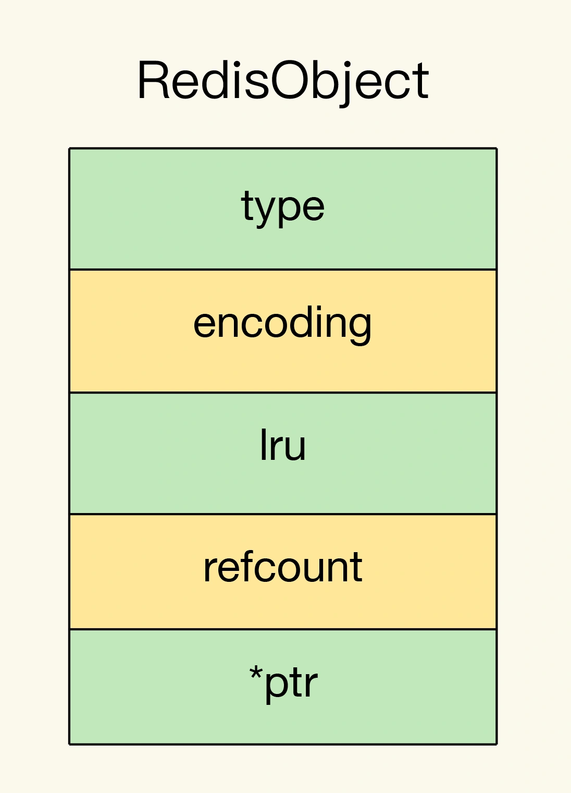

# 自定义数据类型

## 1. 概述

扩展数据类型有两种实现途径：

* **一种是基于现有的数据类型，通过数据编码或是实现新的操作的方式，来实现扩展数据类型**。例如基于 Sorted Set 和 GeoHash 编码实现 GEO，以及基于 String 和位操作实现 Bitmap；
* **另一种就是开发自定义的数据类型**，具体的操作是增加新数据类型的定义，实现创建和释放函数，实现新数据类型支持的命令操作，


## 2. RedisObject

Redis 键值对中的每一个值都是用 RedisObject 保存的。RedisObject 包括元数据和指针。其中，元数据的一个功能就是用来区分不同的数据类型，指针用来指向具体的数据类型的值。

RedisObject 的内部组成包括了 type、encoding、lru 和 refcount 4 个元数据，以及 1 个*ptr指针。

* type：表示值的类型，涵盖了我们前面学习的五大基本类型；
* encoding：是值的编码方式，用来表示 Redis 中实现各个基本类型的底层数据结构，例如 SDS、压缩列表、哈希表、跳表等；
* lru：记录了这个对象最后一次被访问的时间，用于淘汰过期的键值对；
* refcount：记录了对象的引用计数；
* *ptr：是指向数据的指针。



RedisObject 结构借助*ptr指针，就可以指向不同的数据类型，例如，*ptr指向一个 SDS 或一个跳表，就表示键值对中的值是 String 类型或 Sorted Set 类型。

所以，**我们在定义了新的数据类型后，也只要在 RedisObject 中设置好新类型的 type 和 encoding，再用*ptr指向新类型的实现，就行了**。


## 3. 开发新数据类型

首先，我们需要为新数据类型定义好它的底层结构、type 和 encoding 属性值，然后再实现新数据类型的创建、释放函数和基本命令。

**第一步：定义新数据类型的底层结构**

我们用 newtype.h 文件来保存这个新类型的定义，具体定义的代码如下所示：

```c
struct NewTypeObject {
    struct NewTypeNode *head; 
    size_t len; 
}NewTypeObject;
```

其中，NewTypeNode 结构就是我们自定义的新类型的底层结构。我们为底层结构设计两个成员变量：一个是 Long 类型的 value 值，用来保存实际数据；一个是*next指针，指向下一个 NewTypeNode 结构。

```c
struct NewTypeNode {
    long value;
    struct NewTypeNode *next;
};
```

**第二步：在 RedisObject 的 type 属性中，增加这个新类型的定义**

这个定义是在 Redis 的 server.h 文件中。比如，我们增加一个叫作 OBJ_NEWTYPE 的宏定义，用来在代码中指代 NewTypeObject 这个新类型。

```c
#define OBJ_STRING 0    /* String object. */
#define OBJ_LIST 1      /* List object. */
#define OBJ_SET 2       /* Set object. */
#define OBJ_ZSET 3      /* Sorted set object. */
…
#define OBJ_NEWTYPE 7
```

**第三步：开发新类型的创建和释放函数**

Redis 把数据类型的创建和释放函数都定义在了 object.c 文件中。所以，我们可以在这个文件中增加 NewTypeObject 的创建函数 createNewTypeObject，如下所示：

```c
robj *createNewTypeObject(void){
   NewTypeObject *h = newtypeNew(); 
   robj *o = createObject(OBJ_NEWTYPE,h);
   return o;
}
```

先说 newtypeNew 函数。它是用来为新数据类型初始化内存结构的。这个初始化过程主要是用 zmalloc 做底层结构分配空间，以便写入数据。

```c
NewTypeObject *newtypeNew(void){
    NewTypeObject *n = zmalloc(sizeof(*n));
    n->head = NULL;
    n->len = 0;
    return n;
}
```

newtypeNew 函数涉及到新数据类型的具体创建，而 Redis 默认会为每个数据类型定义一个单独文件，实现这个类型的创建和命令操作，例如，t_string.c 和 t_list.c 分别对应 String 和 List 类型。按照 Redis 的惯例，我们就把 newtypeNew 函数定义在名为 t_newtype.c 的文件中。

createObject 是 Redis 本身提供的 RedisObject 创建函数，它的参数是数据类型的 type 和指向数据类型实现的指针*ptr。

我们给 createObject 函数中传入了两个参数，分别是新类型的 type 值 OBJ_NEWTYPE，以及指向一个初始化过的 NewTypeObjec 的指针。这样一来，创建的 RedisObject 就能指向我们自定义的新数据类型了。

```c
robj *createObject(int type, void *ptr) {
    robj *o = zmalloc(sizeof(*o));
    o->type = type;
    o->ptr = ptr;
    ...
    return o;
}
```

对于释放函数来说，它是创建函数的反过程，是用 zfree 命令把新结构的内存空间释放掉。

**第四步：开发新类型的命令操作**

简单来说，增加相应的命令操作的过程可以分成三小步：

1) 在 t_newtype.c 文件中增加命令操作的实现。比如说，我们定义 ntinsertCommand 函数，由它实现对 NewTypeObject 单向链表的插入操作：

```c
void ntinsertCommand(client *c){
  //基于客户端传递的参数，实现在NewTypeObject链表头插入元素
}
```

2)在 server.h 文件中，声明我们已经实现的命令，以便在 server.c 文件引用这个命令，例如：

```c
void ntinsertCommand(client *c)
```


3)在 server.c 文件中的 redisCommandTable 里面，把新增命令和实现函数关联起来。例如，新增的 ntinsert 命令由 ntinsertCommand 函数实现，我们就可以用 ntinsert 命令给 NewTypeObject 数据类型插入元素了。

```c
struct redisCommand redisCommandTable[] = { 
...
{"ntinsert",ntinsertCommand,2,"m",...}
}
```

此时，我们就完成了一个自定义的 NewTypeObject 数据类型，可以实现基本的命令操作了。当然，如果你还希望新的数据类型能被持久化保存，我们还需要在 Redis 的 RDB 和 AOF 模块中增加对新数据类型进行持久化保存的代码。


