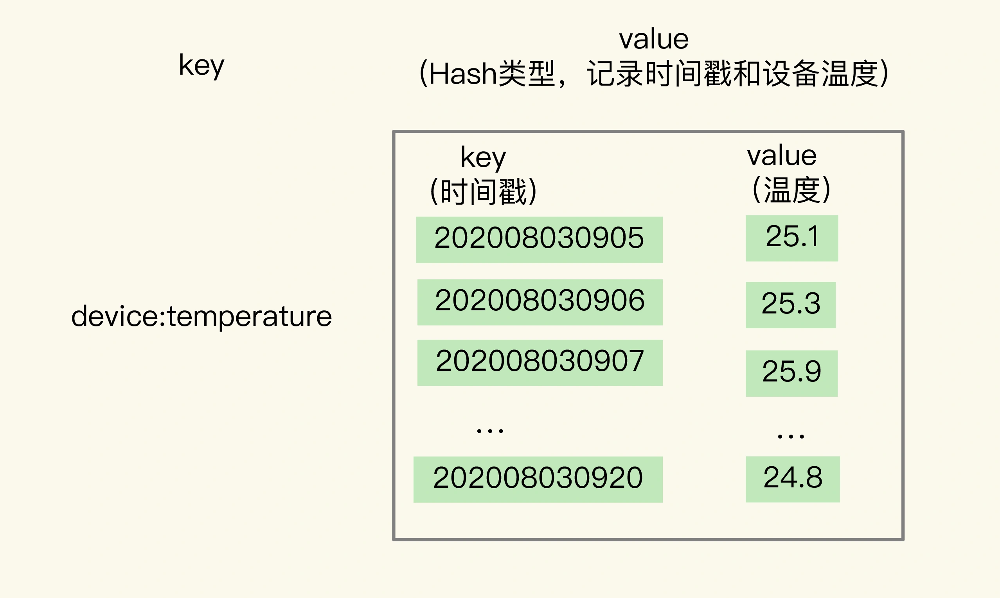
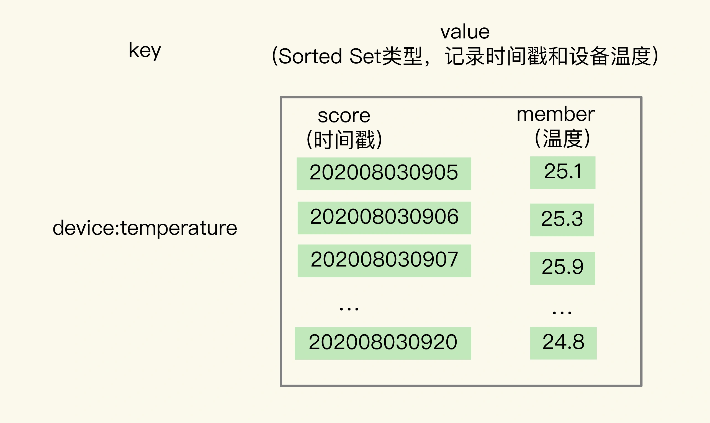
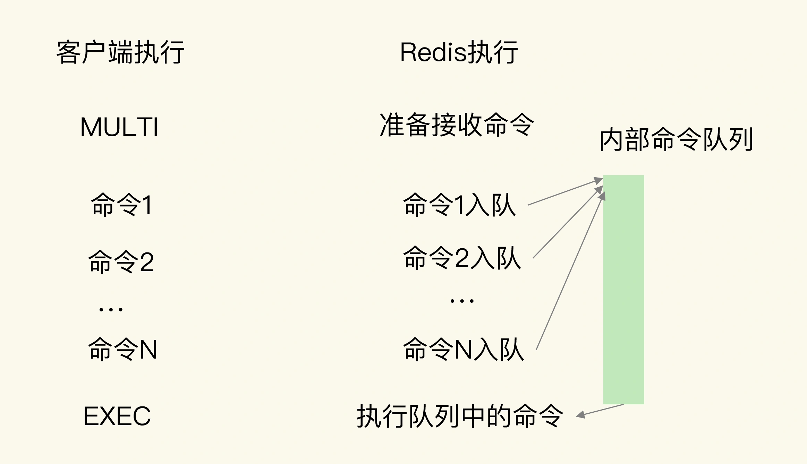

# 如何在Redis中保存时间序列数据？

## 1. 时间序列数据的读写特点

**写**

在实际应用中，**时间序列数据**通常是**持续高并发写入**的，同时，时间序列数据的写入主要就是插入新数据，而不是更新一个已存在的数据，也就是说，一个时间序列数据**被记录后通常就不会变了**，因为它就代表了一个设备在某个时刻的状态值。

所以，**这种数据的写入特点很简单，就是插入数据快，这就要求我们选择的数据类型，在进行数据插入时，复杂度要低，尽量不要阻塞**。

**读**

我们在查询时间序列数据时，既有对单条记录的查询（例如查询某个设备在某一个时刻的运行状态信息，对应的就是这个设备的一条记录），也有对某个时间范围内的数据的查询（例如每天早上 8 点到 10 点的所有设备的状态信息）。

除此之外，还有一些更复杂的查询，比如对某个时间范围内的数据做聚合计算。这里的聚合计算，就是对符合查询条件的所有数据做计算，包括计算均值、最大 / 最小值、求和等。

那用一个词概括时间序列数据的“读”，就是**查询模式多**。

针对时间序列数据的“写要快”，Redis 的高性能写特性直接就可以满足了；

而针对“查询模式多”，也就是要支持单点查询、范围查询和聚合计算，Redis 提供了保存时间序列数据的两种方案，分别可以基于 Hash 和 Sorted Set 实现，以及基于 RedisTimeSeries 模块实现。


## 2. 基于 Hash 和 Sorted Set 保存时间序列数据

我们可以把时间戳作为 Hash 集合的 field，把记录的设备状态值作为 Hash 集合的 value。




当我们想要查询某个时间点或者是多个时间点上的温度数据时，直接使用 HGET 命令或者 HMGET 命令。

```sh
HGET device:temperature 202008030905
"25.1"

HMGET device:temperature 202008030905 202008030907 202008030908
1) "25.1"
2) "25.9"
3) "24.9"
```


*问题1：为什么保存时间序列数据，要同时使用这两种类型？*

**Hash 类型有个短板：它并不支持对数据进行范围查询,所以需要 SortedSet 来支持范围查询**。

**为了能同时支持按时间戳范围的查询，可以用 Sorted Set 来保存时间序列数据**，因为它能够根据元素的权重分数来排序。我们可以把时间戳作为 Sorted Set 集合的元素分数，把时间点上记录的数据作为元素本身。



使用 Sorted Set 保存数据后，我们就可以使用 ZRANGEBYSCORE 命令，按照输入的最大时间戳和最小时间戳来查询这个时间范围内的温度值了

```sh
ZRANGEBYSCORE device:temperature 202008030907 202008030910
1) "25.9"
2) "24.9"
3) "25.3"
4) "25.2"
```


*问题2：如何保证写入 Hash 和 Sorted Set 是一个原子性的操作呢？*

> 只有保证了写操作的原子性，才能保证同一个时间序列数据，在 Hash 和 Sorted Set 中，要么都保存了，要么都没保存。

可以使用 Redis 用来实现简单的事务的 MULTI 和 EXEC 命令。

* MULTI 命令：表示一系列原子性操作的开始。收到这个命令后，Redis 就知道，接下来再收到的命令需要放到一个内部队列中，后续一起执行，保证原子性。
* EXEC 命令：表示一系列原子性操作的结束。一旦 Redis 收到了这个命令，就表示所有要保证原子性的命令操作都已经发送完成了。此时，Redis 开始执行刚才放到内部队列中的所有命令操作。



以保存设备状态信息的需求为例，我们执行下面的代码，把设备在 2020 年 8 月 3 日 9 时 5 分的温度，分别用 HSET 命令和 ZADD 命令写入 Hash 集合和 Sorted Set 集合。

```sh
127.0.0.1:6379> MULTI
OK

127.0.0.1:6379> HSET device:temperature 202008030911 26.8
QUEUED

127.0.0.1:6379> ZADD device:temperature 202008030911 26.8
QUEUED

127.0.0.1:6379> EXEC
1) (integer) 1
2) (integer) 1
```


*问题3：如何对时间序列数据进行聚合计算？*

因为 Sorted Set 只支持范围查询，无法直接进行聚合计算，所以，我们只能先把时间范围内的数据取回到客户端，然后在客户端自行完成聚合计算。

这个方法虽然能完成聚合计算，但是会带来一定的潜在风险，也就是**大量数据在 Redis 实例和客户端间频繁传输，这会和其他操作命令竞争网络资源，导致其他操作变慢**。

为了避免客户端和 Redis 实例间频繁的大量数据传输，我们可以使用 **RedisTimeSeries **来保存时间序列数据。


## 3. 基于 RedisTimeSeries 模块保存时间序列数据

**RedisTimeSeries 是 Redis 的一个扩展模块**。它专门面向时间序列数据提供了数据类型和访问接口，并且支持在 Redis 实例上直接对数据进行按时间范围的聚合计算。

因为 RedisTimeSeries 不属于 Redis 的内建功能模块，在使用时，我们需要先把它的源码单独编译成动态链接库 redistimeseries.so，再使用 loadmodule 命令进行加载，如下所示：

```sh
loadmodule redistimeseries.so
```

当用于时间序列数据存取时，RedisTimeSeries 的操作主要有 5 个：

* 用 TS.CREATE 命令创建时间序列数据集合；
* 用 TS.ADD 命令插入数据；
* 用 TS.GET 命令读取最新数据；
* 用 TS.MGET 命令按标签过滤查询数据集合；
* 用 TS.RANGE 支持聚合计算的范围查询。


**1. 用 TS.CREATE 命令创建一个时间序列数据集合**

在 TS.CREATE 命令中，我们需要设置时间序列数据集合的 key 和数据的过期时间（以毫秒为单位）。此外，我们还可以为数据集合设置标签，来表示数据集合的属性。

例如，我们执行下面的命令，创建一个 key 为 device:temperature、数据有效期为 600s 的时间序列数据集合。也就是说，这个集合中的数据创建了 600s 后，就会被自动删除。最后，我们给这个集合设置了一个标签属性{device_id:1}，表明这个数据集合中记录的是属于设备 ID 号为 1 的数据。

```sh
TS.CREATE device:temperature RETENTION 600000 LABELS device_id 1
OK
```

**2. 用 TS.ADD 命令插入数据，用 TS.GET 命令读取最新数据**

我们可以用 TS.ADD 命令往时间序列集合中插入数据，包括**时间戳和具体的数值**，并使用 TS.GET 命令读取数据集合中的**最新一条数据**。

```sh
TS.ADD device:temperature 1596416700 25.1
1596416700

TS.GET device:temperature 
25.1
```

**3. 用 TS.MGET 命令按标签过滤查询数据集合**

在保存多个设备的时间序列数据时，我们通常会把不同设备的数据保存到不同集合中。此时，我们就可以使用 TS.MGET 命令，按照标签查询部分集合中的最新数据。

例如查询 设备ID不等于2的所有其他设备的数据集合。

```sh
TS.MGET FILTER device_id!=2 
1) 1) "device:temperature:1"
   2) (empty list or set)
   3) 1) (integer) 1596417000
      2) "25.3"
2) 1) "device:temperature:3"
   2) (empty list or set)
   3) 1) (integer) 1596417000
      2) "29.5"
3) 1) "device:temperature:4"
   2) (empty list or set)
   3) 1) (integer) 1596417000
      2) "30.1"
```

**4. 用 TS.RANGE 支持需要聚合计算的范围查询**

最后，在对时间序列数据进行聚合计算时，我们可以使用 TS.RANGE 命令指定要查询的数据的时间范围，同时用 AGGREGATION 参数指定要执行的聚合计算类型。RedisTimeSeries 支持的聚合计算类型很丰富，包括求均值（avg）、求最大 / 最小值（max/min），求和（sum）等。

例如，在执行下列命令时，我们就可以按照每 180s 的时间窗口，对 2020 年 8 月 3 日 9 时 5 分和 2020 年 8 月 3 日 9 时 12 分这段时间内的数据进行均值计算了。

```sh
TS.RANGE device:temperature 1596416700 1596417120 AGGREGATION avg 180000
1) 1) (integer) 1596416700
   2) "25.6"
2) 1) (integer) 1596416880
   2) "25.8"
3) 1) (integer) 1596417060
   2) "26.1"
```

与使用 Hash 和 Sorted Set 来保存时间序列数据相比，RedisTimeSeries 是专门为时间序列数据访问设计的扩展模块，能支持在 Redis 实例上直接进行聚合计算，以及按标签属性过滤查询数据集合，当我们需要频繁进行聚合计算，以及从大量集合中筛选出特定设备或用户的数据集合时，RedisTimeSeries 就可以发挥优势了。


## 4. 小结

时间序列数据特点

* 快速写入
* 点查询，根据一个时间戳，查询相应时间的数据；
* 范围查询，查询起始和截止时间戳范围内的数据；
* 聚合计算，针对起始和截止时间戳范围内的所有数据进行计算，例如求最大 / 最小值，求均值等。

存储方案

* Hash 和 Sorted Set 
  * 利用 Hash 类型实现对单键的快速查询
  * 利用 Sorted Set 实现对范围查询的高效支持
  * 在执行聚合计算时，我们需要把数据读取到客户端再进行聚合，当有大量数据要聚合时，数据传输开销大
  * 所有的数据会在两个数据类型中各保存一份，内存开销不小。
* RedisTimeSeries 模块
  * 专门为存取时间序列数据而设计的扩展模块
  * 能支持直接在 Redis 实例上进行多种数据聚合计算，避免了大量数据在实例和客户端间传输
  * 层数据结构使用了链表，它的范围查询的复杂度是 O(N) 级别的
  * S.GET 查询只能返回最新的数据，没有办法像第一种方案的 Hash 类型一样，可以返回任一时间点的数据。


所以，组合使用 Hash 和 Sorted Set，或者使用 RedisTimeSeries，在支持时间序列数据存取上各有优劣势。我给你的建议是：

* 如果你的部署环境中网络带宽高、Redis 实例内存大，可以优先考虑第一种方案；
* 如果你的部署环境中网络、内存资源有限，而且数据量大，聚合计算频繁，需要按数据集合属性查询，可以优先考虑第二种方案。