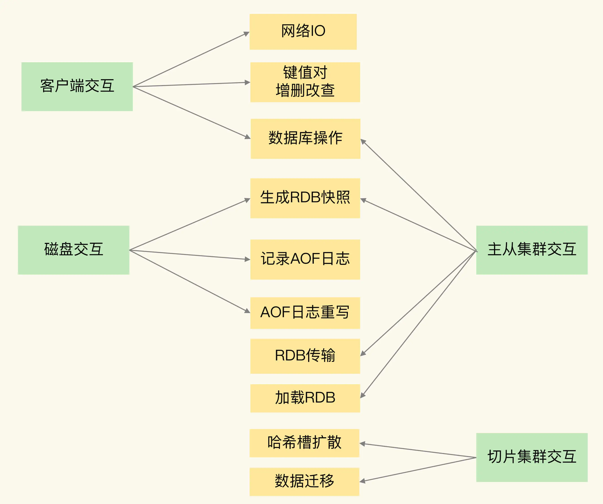
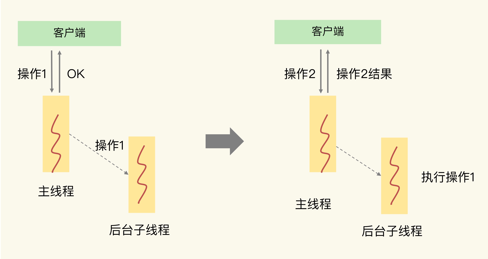
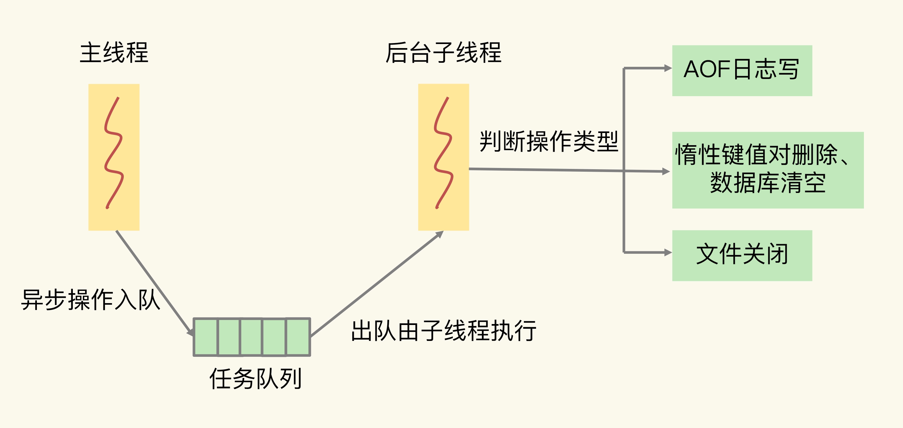

# 异步机制：如何避免单线程模型的阻塞？

## 1. 概述

Redis 之所以被广泛应用，很重要的一个原因就是它支持高性能访问。我们必须要重视所有可能影响 Redis 性能的因素（例如命令操作、系统配置、关键机制、硬件配置等），不仅要知道具体的机制，尽可能避免性能异常的情况出现，还要提前准备好应对异常的方案。

**影响 Redis 性能的 5 大方面的潜在因素：**

* 1）Redis 内部的阻塞式操作；
* 2）CPU 核和 NUMA 架构的影响；
* 3）Redis 关键系统配置；
* 4）Redis 内存碎片；
* 5）Redis 缓冲区。

**Redis 实例有哪些阻塞点？**

Redis 实例交互的对象，以及交互时会发生的操作，从中分析可能的阻塞点：

* **客户端交互**：网络 IO，键值对增删改查操作，数据库操作；
* **磁盘交互**：生成 RDB 快照，记录 AOF 日志，AOF 日志重写；
* **主从节点交互**：主库生成、传输 RDB 文件，从库接收 RDB 文件、清空数据库、加载 RDB 文件；
* **切片集群交互**：向其他实例传输哈希槽信息，数据迁移。

## 2. 阻塞点分析

### 2.1 客户端交互

Redis 和客户端交互包括以下操作：

* 网络 IO
* 键值对增删改查操作
* 数据库操作

Redis 使用了**IO 多路复用机制**，避免了主线程一直处在等待网络连接或请求到来的状态，所以，网络 IO 不是导致 Redis 阻塞的因素。

键值对的增删改查操作是 Redis 主线程的主要任务，所以，**复杂度高的增删改查操作肯定会阻塞 Redis**。

**Redis 中涉及集合的操作复杂度通常为 O(N)**，我们要在使用时重视起来。例如**集合元素全量查询**操作 HGETALL、SMEMBERS，以及**集合的聚合统计**操作，例如求交、并和差集。这些操作可以作为 Redis 的**第一个阻塞点：集合全量查询和聚合操作**。

另外集合自身的删除操作同样也有潜在的阻塞风险。

删除操作的本质是要释放键值对占用的内存空间。释放内存只是第一步，为了更加高效地管理内存空间，在应用程序释放内存时，操作系统需要**把释放掉的内存块插入一个空闲内存块的链表**，以便后续进行管理和再分配。这个过程本身需要一定时间，而且会阻塞当前释放内存的应用程序。

所以，如果一下子释放了大量内存，空闲内存块链表操作时间就会增加，相应地就会造成 Redis 主线程的阻塞。

下表为不同元素数量的集合在进行删除操作时所消耗的时间：

| 集合类型  | 10万(8字节) | 100万(8字节) | 10万 (128字节) | 100万 (128字节) |
| --------- | ----------- | ------------ | -------------- | --------------- |
| Hash      | 50ms        | 962ms        | 91ms           | 1980ms          |
| List      | 25ms        | 133ms        | 29ms           | 283ms           |
| Set       | 42ms        | 821ms        | 75ms           | 1347ms          |
| SortedSet | 53ms        | 809ms        | 61ms           | 991ms           |

可以看到集合元素越大，元素越多，删除所花费的时间就越长；100万 (128字节)元素的 Hash 集合删除需要近 两秒的时间，不可避免的会阻塞主线程。

**bigkey 删除操作就是 Redis 的第二个阻塞点**

除此之外，情况数据库（例如 FLUSHDB 和 FLUSHALL 操作）必然也是一个潜在的阻塞风险，因为它涉及到删除和释放所有的键值对。所以 Redis 的**第三个阻塞点：清空数据库**。

### 2.2 和磁盘交互

Redis 和磁盘交互包括：

* 生成 RDB 快照
* 记录 AOF 日志
* AOF 日志重写

Redis 开发者早已认识到磁盘 IO 会带来阻塞，所以就把 Redis 进一步设计为采用子进程的方式生成 RDB 快照文件，以及执行 AOF 日志重写操作，避免阻塞主线程。

但是 Redis 直接记录 AOF 日志时，会根据不同的写回策略对数据做落盘保存。一个同步写磁盘的操作的耗时大约是 1～2ms，如果有大量的写操作需要记录在 AOF 日志中，并同步写回的话，就会阻塞主线程了。这就得到了 **Redis 的第四个阻塞点了：AOF 日志同步写**。

### 2.3 主从节点交互

包括以下操作：

* 主库生成、传输 RDB 文件
* 从库接收 RDB 文件、清空数据库、加载 RDB 文件；

主库在复制的过程中，需要主库创建和传输 RDB 文件给从库，好在创建和传输 RDB 文件都是由子进程来完成的，不会阻塞主线程。

但是从库接收到 RDB 文件后，需要使用 FLUSHDB 命令清空当前数据库，这就正好撞上了刚才我们分析的**第三个阻塞点**。

此外，从库在清空当前数据库后，还需要把 RDB 文件加载到内存，这个过程的快慢和 RDB 文件的大小密切相关，RDB 文件越大，加载过程越慢，所以，**加载 RDB 文件就成为了 Redis 的第五个阻塞点**。

### 2.4 切片集群交互

包括：

* 向其他实例传输哈希槽信息
* 数据迁移

在 Redis Cluster 中，每个 Redis 实例上分配的哈希槽信息需要在不同实例间进行传递，同时，当需要进行负载均衡或者有实例增删时，数据会在不同的实例间进行迁移。

不过，哈希槽的信息量不大，而数据迁移是渐进式执行的，所以，一般来说，这两类操作对 Redis 主线程的阻塞风险不大。

### 小结

Redis 的 5 个阻塞点:

* 集合全量查询和聚合操作；
* bigkey 删除；
* 清空数据库；
* AOF 日志同步写；
* 从库加载 RDB 文件。

## 3. 异步机制

**为了避免阻塞式操作，Redis 提供了异步线程机制。**即启动一下子线程，再后台完成这些操作。

### 3.1 关键路径操作

如果客户端发给 Redis 的某些操作不需要 Redis 返回具体结果，那这些操作就称为 非关键路径操作，如果需要立刻执行完该操作并向客户端返回具体结果就是关键路径操作。

以上图为例：

主线程接收到操作 1 后，因为操作 1 并不用给客户端返回具体的数据，所以，主线程可以把它交给后台子线程来完成，同时只要给客户端返回一个“OK”结果就行。在子线程执行操作 1 的时候，客户端又向 Redis 实例发送了操作 2，而此时，客户端是需要使用操作 2 返回的数据结果的，如果操作 2 不返回结果，那么，客户端将一直处于等待状态。

在这个例子中，操作 1 就不算关键路径上的操作，因为它不用给客户端返回具体数据，所以可以由后台子线程异步执行。而操作 2 需要把结果返回给客户端，它就是关键路径上的操作，所以主线程必须立即把这个操作执行完。

对于 Redis 来说，**读操作是典型的关键路径操作**，因为客户端发送了读操作之后，就会等待读取的数据返回，以便进行后续的数据处理。

第一个阻塞点“集合全量查询和聚合操作”都涉及到了读操作，所以，它们是不能进行异步操作了。

第二个阻塞点“bigkey 删除”，和第三个阻塞点“清空数据库”，都是对数据做删除，并不在关键路径上。因此，我们可以使用后台子线程来异步执行删除操作。

对于第四个阻塞点“AOF 日志同步写”来说，为了保证数据可靠性，Redis 实例需要保证 AOF 日志中的操作记录已经落盘，这个操作虽然需要实例等待，但它并不会返回具体的数据结果给实例。所以，我们也可以启动一个子线程来执行 AOF 日志的同步写，而不用让主线程等待 AOF 日志的写完成。

最后看下，“从库加载 RDB 文件”这个阻塞点。从库要想对客户端提供数据存取服务，就必须把 RDB 文件加载完成。所以，这个操作也属于关键路径上的操作，我们必须让从库的主线程来执行。

所以，我们可以使用 Redis 的异步子线程机制来实现 **bigkey 删除**，**清空数据库**，以及 **AOF 日志同步写**。

### 3.2 异步的子线程机制

Redis 主线程启动后，会使用操作系统提供的 pthread_create 函数创建 3 个子线程，分别由它们负责 AOF 日志写操作、键值对删除以及文件关闭的异步执行。

主线程通过一个链表形式的任务队列和子线程进行交互。当收到键值对删除和清空数据库的操作时，主线程会把这个操作封装成一个任务，放入到任务队列中，然后给客户端返回一个完成信息，表明删除已经完成。

但实际上，这个时候删除还没有执行，等到后台子线程从任务队列中读取任务后，才开始实际删除键值对，并释放相应的内存空间。因此，我们把这种异步删除也称为惰性删除（lazy free）。此时，删除或清空操作不会阻塞主线程，这就避免了对主线程的性能影响。

和惰性删除类似，当 AOF 日志配置成 everysec 选项后，主线程会把 AOF 写日志操作封装成一个任务，也放到任务队列中。后台子线程读取任务后，开始自行写入 AOF 日志，这样主线程就不用一直等待 AOF 日志写完了。

Redis 4.0 提供了对 异步的键值对删除和数据库清空操作的支持，实际上就是使用上面的方式来实现的，具体命令如下：

* 键值对删除：当你的集合类型中有大量元素（例如有百万级别或千万级别元素）需要删除时，我建议你使用 UNLINK 命令。
* 清空数据库：可以在 FLUSHDB 和 FLUSHALL 命令后加上 ASYNC 选项，这样就可以让后台子线程异步地清空数据库

### 3.3 lazy-free

* 1）azy-free是4.0新增的功能，但是默认是关闭的，需要手动开启。
* 2）手动开启lazy-free时，有4个选项可以控制，分别对应不同场景下，要不要开启异步释放内存机制：
  *  lazyfree-lazy-expire：key在过期删除时尝试异步释放内存
  * lazyfree-lazy-eviction：内存达到maxmemory并设置了淘汰策略时尝试异步释放内存
  * lazyfree-lazy-server-del：执行RENAME/MOVE等命令或需要覆盖一个key时，删除旧key尝试异步释放内存
  * replica-lazy-flush：主从全量同步，从库清空数据库时异步释放内存
* 3）即使开启了lazy-free，如果直接使用DEL命令还是会同步删除key，只有使用UNLINK命令才会可能异步删除key。
  * 注意：不管是Del还是Unlink命令，Redis中的Key都是同步删除的，即先将Key-Value从全局哈希表移除，然后如果是Unlink且Value比较大才会异步删除Value。

* 4）这也是最关键的一点，上面提到开启lazy-free的场景，除了replica-lazy-flush之外，其他情况都只是*可能*去异步释放key的内存，并不是每次必定异步释放内存的。

开启lazy-free后，Redis在释放一个key的内存时，**首先会评估代价**，如果释放内存的代价很小，那么就直接在主线程中操作了，没必要放到异步线程中执行（不同线程传递数据也会有性能消耗）。

什么情况才会真正异步释放内存？这和key的类型、编码方式、元素数量都有关系（详细可参考源码中的lazyfreeGetFreeEffort函数）：

* 1）当Hash/Set底层采用哈希表存储（非ziplist/int编码存储）时，并且元素数量超过64个
* 2）当ZSet底层采用跳表存储（非ziplist编码存储）时，并且元素数量超过64个
* 3）当List链表节点数量超过64个（注意，不是元素数量，而是链表节点的数量，List的实现是在每个节点包含了若干个元素的数据，这些元素采用ziplist存储）

只有以上这些情况，在删除key释放内存时，才会真正放到异步线程中执行，其他情况一律还是在主线程操作。

也就是说String（不管内存占用多大）、List（少量元素）、Set（int编码存储）、Hash/ZSet（ziplist编码存储）这些情况下的key在释放内存时，依旧在主线程中操作。

可见，即使开启了lazy-free，String类型的bigkey，在删除时依旧有阻塞主线程的风险。所以，即便Redis提供了lazy-free，我建议还是尽量不要在Redis中存储bigkey。

个人理解：**Redis在设计评估释放内存的代价时，不是看key的内存占用有多少，而是关注释放内存时的工作量有多大**。

从上面分析基本能看出，如果需要释放的内存是连续的，Redis 作者认为释放内存的代价比较低，就放在主线程做。如果释放的内存不连续（大量指针类型的数据），这个代价就比较高，所以才会放在异步线程中去执行。

## 4. 小结

* 1）5 大阻塞点，包括集合全量查询和聚合操作、bigkey 删除、清空数据库、AOF 日志同步写，以及从库加载 RDB 文件。
* 2）bigkey 删除、清空数据库、AOF 日志同步写不属于关键路径操作，可以使用异步子线程机制来完成
  * bigkey 删除：UNLINK
  * 清空数据库：FLUSHDB/ FLUSHALL命令后跟ASYNC 
  * AOF 日志：配置为 everysec  后会由后台定期处理

建议：

* 集合全量查询和聚合操作：可以使用 SCAN 命令，分批读取数据，再在客户端进行聚合计算；
* 从库加载 RDB 文件：把主库的数据量大小控制在 2~4GB 左右，以保证 RDB 文件能以较快的速度加载。每课一问