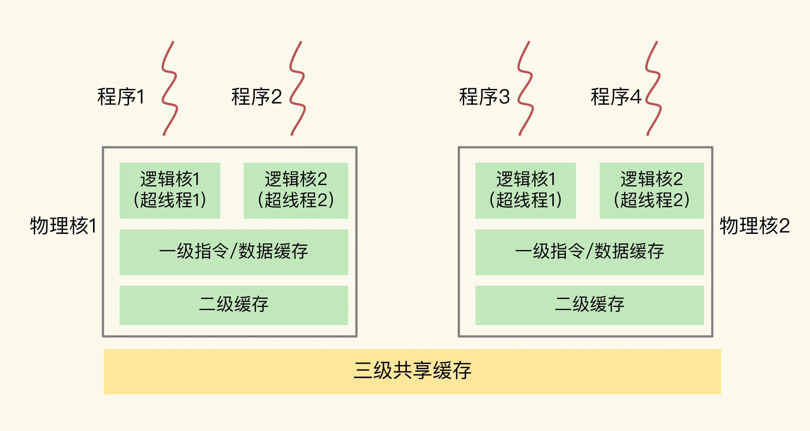
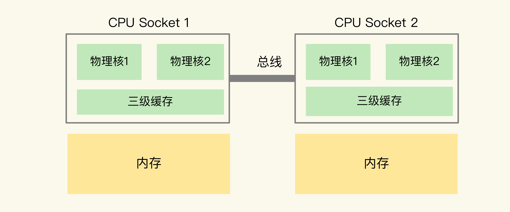
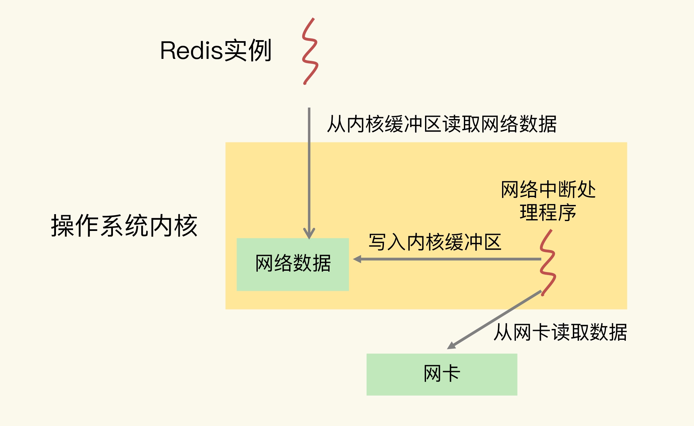
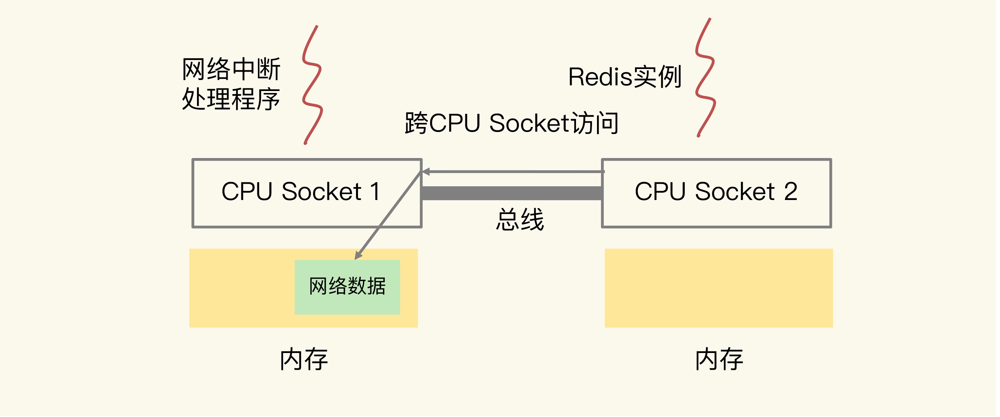
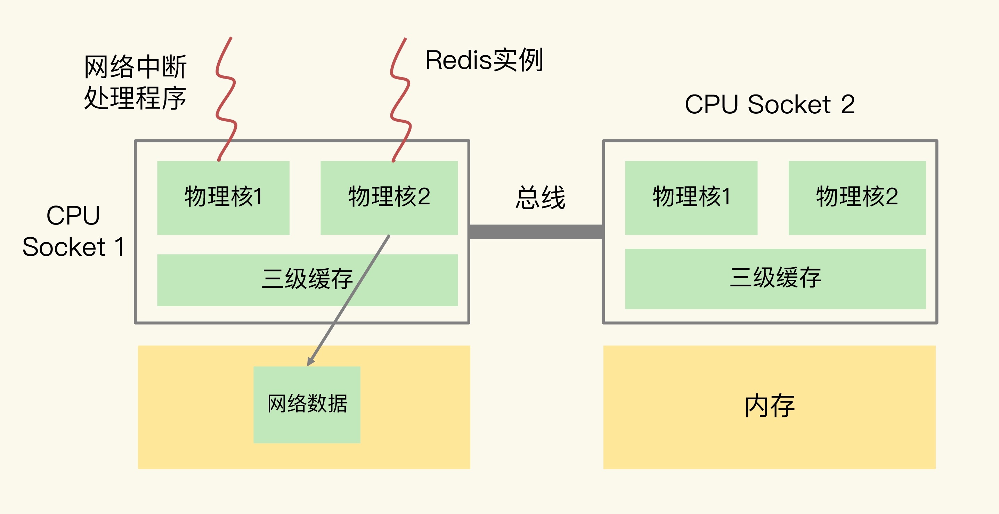

# 为什么CPU结构也会影响Redis的性能？

## 1. 概述

### 主流的 CPU 架构

一个 CPU 处理器中一般有多个运行核心，我们把一个运行核心称为一个物理核，每个物理核都可以运行应用程序。每个物理核都拥有私有的一级缓存（Level 1 cache，简称 L1 cache），包括一级指令缓存和一级数据缓存，以及私有的二级缓存（Level 2 cache，简称 L2 cache）。

因为 L1 和 L2 缓存是每个物理核私有的，所以，当数据或指令保存在 L1、L2 缓存时，物理核访问它们的延迟不超过 `10 纳秒`，速度非常快。那么，如果 Redis 把要运行的指令或存取的数据保存在 L1 和 L2 缓存的话，就能高速地访问这些指令和数据。

但是，这些 L1 和 L2 缓存的大小受限于处理器的制造技术，一般只有 KB 级别，存不下太多的数据。如果 L1、L2 缓存中没有所需的数据，应用程序就需要访问内存来获取数据。而应用程序的访存延迟一般在百纳秒级别，是访问 L1、L2 缓存的延迟的近 10 倍，不可避免地会对性能造成影响。

所以，不同的物理核还会共享一个共同的三级缓存（Level 3 cache，简称为 L3 cache）。L3 缓存能够使用的存储资源比较多，所以一般比较大，能达到几 MB 到几十 MB，这就能让应用程序缓存更多的数据。当 L1、L2 缓存中没有数据缓存时，可以访问 L3，尽可能避免访问内存。

另外，现在主流的 CPU 处理器中，每个物理核通常都会运行两个超线程，也叫作逻辑核。同一个物理核的逻辑核会共享使用 L1、L2 缓存。



在主流的服务器上，一个 CPU 处理器会有 10 到 20 多个物理核。同时，为了提升服务器的处理能力，服务器上通常还会有多个 CPU 处理器（也称为多 CPU Socket），每个处理器有自己的物理核（包括 L1、L2 缓存），L3 缓存，以及连接的内存，同时，不同处理器间通过总线连接。




**在多 CPU 架构上，应用程序可以在不同的处理器上运行。**

注意：如果应用程序先在一个 Socket 上运行，并且把数据保存到了内存，然后被调度到另一个 Socket 上运行，此时，应用程序再进行内存访问时，就需要访问之前 Socket 上连接的内存，**这种访问属于远端内存访问。和访问 Socket 直接连接的内存相比，远端内存访问会增加应用程序的延迟**。

在多 CPU 架构下，一个应用程序访问所在 Socket 的本地内存和访问远端内存的延迟并不一致，所以，我们也把这个架构称为**非统一内存访问架构（Non-Uniform Memory Access，NUMA 架构）**。


### CPU 架构对应用程序运行的影响

CPU 架构对应用程序运行的影响如下：

* 1）L1、L2 缓存中的指令和数据的访问速度很快，所以，充分利用 L1、L2 缓存，可以有效缩短应用程序的执行时间；
* 2）在 NUMA 架构下，如果应用程序从一个 Socket 上调度到另一个 Socket 上，就可能会出现远端内存访问的情况，这会直接增加应用程序的执行时间。


## 2. CPU 多核对 Redis 性能的影响

在一个 CPU 核上运行时，应用程序需要记录自身使用的软硬件资源信息（例如栈指针、CPU 核的寄存器值等），我们把这些信息称为**运行时信息**。同时，应用程序访问最频繁的指令和数据还会被缓存到 L1、L2 缓存上，以便提升执行速度。

在多核 CPU 的场景下，一旦应用程序需要在一个新的 CPU 核上运行，那么，**运行时信息就需要重新加载到新的 CPU 核上**。而且，新的 CPU 核的 **L1、L2 缓存也需要重新加载数据和指令**，这会导致程序的运行时间增加。

**每调度(到其他CPU)一次，一些请求就会受到运行时信息、指令和数据重新加载过程的影响，这就会导致某些请求的延迟明显高于其他请求。**

> 会导致尾延迟升高。


为了避免 Redis 总是在不同 CPU 核上来回调度执行，我们可以使用 **taskset** 命令把一个 Redis 绑定在一个核上运行。

比如说，我们执行下面的命令，就把 Redis 实例绑在了 0 号核上，其中，“-c”选项用于设置要绑定的核编号。

```sh
taskset -c 0 ./redis-server
```

绑核前后的 Redis 的 99% 尾延迟测试如下：

| 命令 | 未绑核运行Redis的99%尾延迟 | 绑核运行Redis的99%尾延迟 |
| ---- | -------------------------- | ------------------------ |
| GET  | 504us                      | 260us                    |
| PUT  | 1175us                     | 482us                    |

在 CPU 多核的环境下，通过绑定 Redis 实例和 CPU 核，可以有效降低 Redis 的尾延迟。


## 3. CPU 的 NUMA 架构对 Redis 性能的影响

在 CPU 的 NUMA 架构下，当网络中断处理程序、Redis 实例分别和 CPU 核绑定后，就会有一个潜在的风险：**如果网络中断处理程序和 Redis 实例各自所绑的 CPU 核不在同一个 CPU Socket 上，那么，Redis 实例读取网络数据时，就需要跨 CPU Socket 访问内存，这个过程会花费较多时间**。

> 最终还是跨 CPU Socket 访问导致性能问题。

Redis 实例和网络中断程序的数据交互流程如下：

* 1）网络中断处理程序从网卡硬件中读取数据，并把数据写入到操作系统内核维护的一块内存缓冲区；
* 2）内核会通过 epoll 机制触发事件，通知 Redis 实例；
* 3）Redis 实例再把数据从内核的内存缓冲区拷贝到自己的内存空间。



如果网络中断处理程序和 Redis 实例各自绑定的 CPU 不在一个 CPU Socket 上，就会出现上面提到的问题，具体如下图所示：



可以看到，图中的网络中断处理程序被绑在了 CPU Socket 1 的某个核上，而 Redis 实例则被绑在了 CPU Socket  2 上。此时，网络中断处理程序读取到的网络数据，被保存在 CPU Socket  1 的本地内存中，当 Redis 实例要访问网络数据时，就需要 Socket 2 通过总线把内存访问命令发送到 Socket 1 上，进行远程访问，时间开销比较大。

> 访问 CPU Socket 本地内存相比，跨 CPU Socket 的内存访问延迟增加了 18%，这自然会导致 Redis 处理请求的延迟增加。

**所以：我们最好把网络中断程序和 Redis 实例绑在同一个 CPU Socket 上。**



**NUMA 架构下 CPU 编号规则**

在 CPU 的 NUMA 架构下，对 CPU 核的编号规则，并不是先把一个 CPU Socket 中的所有逻辑核编完，再对下一个 CPU Socket 中的逻辑核编码，而是先给每个 CPU Socket 中每个物理核的第一个逻辑核依次编号，再给每个 CPU Socket 中的物理核的第二个逻辑核依次编号。

假设有 2 个 CPU Socket，每个 Socket 上有 6 个物理核，每个物理核又有 2 个逻辑核，总共 24 个逻辑核。

我们可以执行 lscpu 命令，查看到这些核的编号：

```sh
lscpu

Architecture: x86_64
...
NUMA node0 CPU(s): 0-5,12-17
NUMA node1 CPU(s): 6-11,18-23
...
```

可以看到，NUMA node0 的 CPU 核编号是 0 到 5、12 到 17。其中，0 到 5 是 node0 上的 6 个物理核中的第一个逻辑核的编号，12 到 17 是相应物理核中的第二个逻辑核编号。NUMA node1 的 CPU 核编号规则和 node0 一样。

> 所以，在绑核时，我们一定要注意，不能想当然地认为第一个 Socket 上的 12 个逻辑核的编号就是 0 到 11。


## 4. 绑核的风险和解决方案

* **在 CPU 多核的场景下**，用 taskset 命令把 Redis 实例和一个核绑定，可以减少 Redis 实例在不同核上被来回调度执行的开销，避免较高的尾延迟；

* **在多 CPU 的 NUMA 架构下**，如果你对网络中断程序做了绑核操作，建议你同时把 Redis 实例和网络中断程序绑在同一个 CPU Socket 的不同核上，这样可以避免 Redis 跨 Socket 访问内存中的网络数据的时间开销。

当我们把 Redis 实例绑到一个 CPU 逻辑核上时，就会**导致子进程、后台线程和 Redis 主线程竞争 CPU 资源**，一旦子进程或后台线程占用 CPU 时，主线程就会被阻塞，导致 Redis 请求延迟增加。

针对这种情况，我来给你介绍两种解决方案，分别是**一个 Redis 实例对应绑一个物理核和优化 Redis 源码**。

**方案一：一个 Redis 实例对应绑一个物理核**

在给 Redis 实例绑核时，我们不要把一个实例和一个逻辑核绑定，而要和一个物理核绑定，也就是说，把一个物理核的 2 个逻辑核都用上。

我们还是以刚才的 NUMA 架构为例，NUMA node0 的 CPU 核编号是 0 到 5、12 到 17。其中，编号 0 和 12、1 和 13、2 和 14 等都是表示一个物理核的 2 个逻辑核。所以，在绑核时，我们使用属于同一个物理核的 2 个逻辑核进行绑核操作。

```sh
taskset -c 0,12 ./redis-server
```

这样可以让主线程、子进程、后台线程共享使用 2 个逻辑核，可以在一定程度上缓解 CPU 资源竞争。但是，因为只用了 2 个逻辑核，它们相互之间的 CPU 竞争仍然还会存在。如果你还想进一步减少 CPU 竞争，我再给你介绍一种方案。

**方案二：优化 Redis 源码**

通过修改 Redis 源码，把子进程和后台线程绑到不同的 CPU 核上。通过编程来实现绑核其实是一种通用做法。

通过编程实现绑核时，要用到操作系统提供的 1 个数据结构 cpu_set_t 和 3 个函数 CPU_ZERO、CPU_SET 和 sched_setaffinity。

* cpu_set_t 数据结构：是一个位图，每一位用来表示服务器上的一个 CPU 逻辑核。
* CPU_ZERO 函数：以 cpu_set_t 结构的位图为输入参数，把位图中所有的位设置为 0。
* CPU_SET 函数：以 CPU 逻辑核编号和 cpu_set_t 位图为参数，把位图中和输入的逻辑核编号对应的位设置为 1。
* sched_setaffinity 函数：以进程 / 线程 ID 号和 cpu_set_t 为参数，检查 cpu_set_t 中哪一位为 1，就把输入的 ID 号所代表的进程 / 线程绑在对应的逻辑核上。

具体绑核流程分四步走：

* 第一步：创建一个 cpu_set_t 结构的位图变量；
* 第二步：使用 CPU_ZERO 函数，把 cpu_set_t 结构的位图所有的位都设置为 0；
* 第三步：根据要绑定的逻辑核编号，使用 CPU_SET 函数，把 cpu_set_t 结构的位图相应位设置为 1；
* 第四步：使用 sched_setaffinity 函数，把程序绑定在 cpu_set_t 结构位图中为 1 的逻辑核上。


具体代码如下：

给线程绑定核

```c

//线程函数
void worker(int bind_cpu){
    cpu_set_t cpuset;  //创建位图变量
    CPU_ZERO(&cpu_set); //位图变量所有位设置0
    CPU_SET(bind_cpu, &cpuset); //根据输入的bind_cpu编号，把位图对应为设置为1
    sched_setaffinity(0, sizeof(cpuset), &cpuset); //把程序绑定在cpu_set_t结构位图中为1的逻辑核

    //实际线程函数工作
}

int main(){
    pthread_t pthread1
    //把创建的pthread1绑在编号为3的逻辑核上
    pthread_create(&pthread1, NULL, (void *)worker, 3);
}
```

对于 Redis 来说，它是在 bio.c 文件中的 bioProcessBackgroundJobs 函数中创建了后台线程。bioProcessBackgroundJobs 函数类似于刚刚的例子中的 worker 函数，在这个函数中实现绑核四步操作，就可以把后台线程绑到和主线程不同的核上了。

fork 子进程绑核

```c

int main(){
   //用fork创建一个子进程
   pid_t p = fork();
   if(p < 0){
      printf(" fork error\n");
   }
   //子进程代码部分
   else if(!p){
      cpu_set_t cpuset;  //创建位图变量
      CPU_ZERO(&cpu_set); //位图变量所有位设置0
      CPU_SET(3, &cpuset); //把位图的第3位设置为1
      sched_setaffinity(0, sizeof(cpuset), &cpuset);  //把程序绑定在3号逻辑核
      //实际子进程工作
      exit(0);
   }
   ...
}
```

对于 Redis 来说，生成 RDB 和 AOF 日志重写的子进程分别是下面两个文件的函数中实现的。

* rdb.c 文件：rdbSaveBackground 函数；
* aof.c 文件：rewriteAppendOnlyFileBackground 函数。

这两个函数中都调用了 fork 创建子进程，所以，我们可以在子进程代码部分加上绑核的四步操作。

使用源码优化方案，我们既可以实现 Redis 实例绑核，避免切换核带来的性能影响，还可以让子进程、后台线程和主线程不在同一个核上运行，避免了它们之间的 CPU 资源竞争。相比使用 taskset 绑核来说，这个方案可以进一步降低绑核的风险。


## 5. 小结

1）CPU 多核对 Redis 的影响

运行时信息就需要重新加载到新的 CPU 核上，L1、L2 缓存也需要重新加载数据和指令。

解决方案：taskset 命令绑定 CPU 核

2）NUMA 架构对 Redis 的影响

NUMA 架构下存在跨 CPU Socket 访问的问题，如果网络中断处理程序和 Redis 实例各自所绑的 CPU 核不在同一个 CPU Socket 上，那么，Redis 实例读取网络数据时，就需要跨 CPU Socket 访问内存，这个过程会花费较多时间。

解决方案：还是绑定核，将网络中断处理程序和 Redis 实例绑定到同一个 CPU Socket 上。

3）绑核的风险

Redis 主线程和子进程、后台线程会竞争 CPU。

解决方案：

* 1）taskset 时绑定一个 CPU 上的多个核，降低竞争
* 2）修改源码，将子进程、后台线程分别绑定到不同的核上。


4）编程实现绑核流程

* 第一步：创建一个 cpu_set_t 结构的位图变量；
* 第二步：使用 CPU_ZERO 函数，把 cpu_set_t 结构的位图所有的位都设置为 0；
* 第三步：根据要绑定的逻辑核编号，使用 CPU_SET 函数，把 cpu_set_t 结构的位图相应位设置为 1；
* 第四步：使用 sched_setaffinity 函数，把程序绑定在 cpu_set_t 结构位图中为 1 的逻辑核上。

