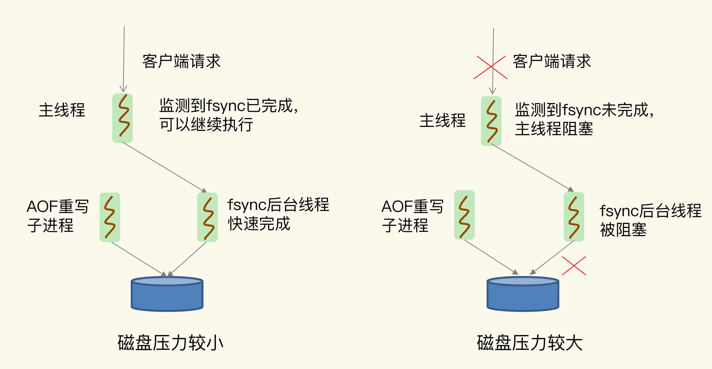

# 波动的响应延迟：如何应对变慢的Redis？（上）

## 1. 概述

在实际部署中有一个非常严重的问题，那就是 Redis 突然变慢了。一旦出现这个问题，不仅会直接影响用户的使用体验，还可能会影响到“旁人”，也就是和 Redis 在同一个业务系统中的其他系统，比如说数据库。

*我们首先要弄清楚，如何判断 Redis 是不是真的变慢了？*

一个最直接的方法，就是**查看 Redis 的响应延迟**。

大部分时候，Redis 延迟很低，但是在某些时刻，有些 Redis 实例会出现很高的响应延迟，甚至能达到几秒到十几秒，不过持续时间不长，这也叫延迟“毛刺”。当你发现 Redis 命令的执行时间突然就增长到了几秒，基本就可以认定 Redis 变慢了。

> 这种方法是看 Redis 延迟的绝对值，但是，在不同的软硬件环境下，Redis 本身的绝对性能并不相同。

第二个方法了，也就是**基于当前环境下的 Redis 基线性能做判断**。所谓的基线性能呢，也就是一个系统在低压力、无干扰下的基本性能，这个性能只由当前的软硬件配置决定。

redis-cli 命令提供了`–intrinsic-latency` 选项，可以用来监测和统计测试期间内的最大延迟，这个延迟可以作为 Redis 的基线性能。

比如说，我们运行下面的命令，该命令会打印 120 秒内监测到的最大延迟。可以看到，这里的最大延迟是 119 微秒，也就是基线性能为 119 微秒。

```sh
./redis-cli --intrinsic-latency 120
Max latency so far: 17 microseconds.
Max latency so far: 44 microseconds.
Max latency so far: 94 microseconds.
Max latency so far: 110 microseconds.
Max latency so far: 119 microseconds.

36481658 total runs (avg latency: 3.2893 microseconds / 3289.32 nanoseconds per run).
Worst run took 36x longer than the average latency.
```

一般来说，你要把运行时延迟和基线性能进行对比，**如果你观察到的 Redis 运行时延迟是其基线性能的 2 倍及以上，就可以认定 Redis 变慢了**。

> 虚拟化环境（例如虚拟机或容器）中，由于增加了虚拟化软件层，与物理机相比，虚拟机或容器本身就会引入一定的性能开销，所以基线性能会高一些。

如果你想了解网络对 Redis 性能的影响，一个简单的方法是用 `iPerf` 这样的工具，测量从 Redis 客户端到服务器端的网络延迟。如果这个延迟有几十毫秒甚至是几百毫秒，就说明，Redis 运行的网络环境中很可能有大流量的其他应用程序在运行，导致网络拥塞了。这个时候，你就需要协调网络运维，调整网络的流量分配了。


## 2. 如何应对 Redis 变慢？

### Redis 自身操作特性的影响

**1. 慢查询命令**

慢查询命令主要指 Redis 中操作时间复杂度比较高的命令。

比如 Set 类型的 SORT、SUNION/SMEMBERS 操作复杂度分别为 O(N+M*log(M)) 和 O(N)。其中，N 为 Set 中的元素个数，M 为 SORT 操作返回的元素个数。这个复杂度就很高了。

> 注：还有 KEYS 命令需要遍历存储的键值对，所以操作延时高，一般不被建议用于生产环境中。

如果的确有大量的慢查询命令，有两种处理方式：

* **用其他高效命令代替**。比如说，如果你需要返回一个 SET 中的所有成员时，不要使用 SMEMBERS 命令，而是要使用 SSCAN 多次迭代返回，避免一次返回大量数据，造成线程阻塞。
* **当你需要执行排序、交集、并集操作时，可以在客户端完成，而不要用 SORT、SUNION、SINTER 这些命令，以免拖慢 Redis 实例。**


> 当然，如果业务逻辑就是要求使用慢查询命令，那你得考虑采用性能更好的 CPU，更快地完成查询命令，避免慢查询的影响。


**2. 过期 key 操作**

默认情况下，Redis 每 100 毫秒会删除一些过期 key，具体的算法如下：

* 采样 ACTIVE_EXPIRE_CYCLE_LOOKUPS_PER_LOOP 个数的 key，并将其中过期的 key 全部删除；
* 如果超过 25% 的 key 过期了，则会重复删除的过程，直到过期 key 的比例降至 25% 以下。

ACTIVE_EXPIRE_CYCLE_LOOKUPS_PER_LOOP 是 Redis 的一个参数，默认是 20，那么，一秒内基本有 200 个过期 key 会被删除。这一策略对清除过期 key、释放内存空间很有帮助。如果每秒钟删除 200 个过期 key，并不会对 Redis 造成太大影响。

但是，如果触发了上面这个算法的第二条，Redis 就会一直删除以释放内存空间。注意，**删除操作是阻塞的**（Redis 4.0 后可以用异步线程机制来减少阻塞影响）。

第二条算法被触发的一个重要原因就是**频繁使用带有相同时间参数的 EXPIREAT 命令设置过期 key，**这就会导致，在同一秒内有大量的 key 同时过期。

为了解决该问题，**可以在 EXPIREAT 和 EXPIRE 的过期时间参数上，加上一个一定大小范围内的随机数**，这样，既保证了 key 在一个邻近时间范围内被删除，又避免了同时过期造成的压力


### 文件系统：AOF 模式

为了保证数据可靠性，Redis 会采用 AOF 日志或 RDB 快照。其中，AOF 日志提供了三种日志写回策略：no、everysec、always。这三种写回策略依赖文件系统的两个系统调用完成，也就是 write 和 fsync。

* write 只要把日志记录写到内核缓冲区，就可以返回了，并不需要等待日志实际写回到磁盘；
* 而 fsync 需要把日志记录写回到磁盘后才能返回，时间较长。


当写回策略配置为 everysec 时，Redis 会使用后台的子线程异步完成 fsync 的操作。而对于 always 策略来说,由于需要确保每个操作记录日志都写回磁盘，所以是在主线程中执行。

> 注意：everysec 时虽然是由后台的子线程异步完成 fsync，但是并不是说启动一个后台子线程让它自己每秒调一下 fsync，而是主线程每秒会手动触发，然后台子线程调用 fsync。
>
> 之所以这样是为了让主线程监控后台子线程 fsync 的完成情况。


同时为了避免日志文件不断增大，Redis 会执行 AOF 重写，这也会对磁盘进行大量 IO 操作。

而 fsync 又需要等到数据写到磁盘后才能返回，所以，当 AOF 重写的压力比较大时，就会导致 fsync 被阻塞。

> 虽然 fsync 是由后台子线程负责执行的，但正如前面说的主线程会监控 fsync 的执行进度。

当主线程准备再次把新接收的操作记录写回磁盘时，如果主线程发现上一次叫后台线程执行的 fsync 还没有执行完，那么它就会阻塞。

> 所以，如果后台子线程执行的 fsync 频繁阻塞的话（比如 AOF 重写占用了大量的磁盘 IO 带宽），主线程也会阻塞，导致 Redis 性能变慢。

具体见下图：



即由于 fsync 后台子线程和 AOF 重写子进程的存在，主 IO 线程一般不会被阻塞。但是，如果在重写日志时，AOF 重写子进程的写入量比较大，fsync 线程也会被阻塞，进而阻塞主线程，导致延迟增加。

**如何优化该问题？**

如果 AOF 写回策略使用了 everysec 或 always 配置，那么首先就是确认业务方对数据可靠性的要求，明确是否需要每一秒或每一个操作都记日志。

> 有的业务方不了解 Redis AOF 机制，很可能就直接使用数据可靠性最高等级的 always 配置了。另外，在有些场景中（例如 Redis 用于缓存），数据丢了还可以从后端数据库中获取，并不需要很高的数据可靠性。

如果业务应用对延迟非常敏感，但同时允许一定量的数据丢失，那么，可以把配置项 no-appendfsync-on-rewrite 设置为 yes，如下所示：

```sh
no-appendfsync-on-rewrite yes
```

这个配置表示在 AOF 重写时，是否进行 fsync 操作。配置为 yes 后自然不会出现 AOF 和 fsync 导致的 IO 阻塞问题。当然，如果此时实例发生宕机，就会导致数据丢失。

如果的确需要高性能，同时也需要高可靠数据保证，我建议你考虑**采用高速的固态硬盘作为 AOF 日志的写入设备**。


### 操作系统：swap

**内存 swap 是操作系统里将内存数据在内存和磁盘间来回换入和换出的机制**，涉及到磁盘的读写，所以，一旦触发 swap，无论是被换入数据的进程，还是被换出数据的进程，其性能都会受到慢速磁盘读写的影响。

这一点对于 Redis 内存数据库而言，显得更为重要：正常情况下，Redis 的操作是直接通过访问内存就能完成，一旦 swap 被触发了，Redis 的请求操作需要等到磁盘数据读写完成才行。

> wap 触发后影响的是 Redis 主 IO 线程，这会极大地增加 Redis 的响应时间。

通常，**触发 swap 的原因主要是物理机器内存不足**，对于 Redis 而言，有两种常见的情况：

* Redis 实例自身使用了大量的内存，导致物理机器的可用内存不足；
* 和 Redis 实例在同一台机器上运行的其他进程占用大量系统内存，这会导致分配给 Redis 实例的内存量变少，进而触发 Redis 发生 swap。

这种情况**增加机器的内存或者使用 Redis 集群。**


### 操作系统：内存大页

除了内存 swap，还有一个和内存相关的因素，即内存大页机制（Transparent Huge Page, THP），也会影响 Redis 性能。

> Linux 内核从 2.6.38 开始支持内存大页机制，该机制支持 2MB 大小的内存页分配，而常规的内存页分配是按 4KB 的粒度来执行的。

内存大页对 Redis 的影响主要体现在 持久化上。

Redis 生成 RDB 快照时采用**写时复制机制**，也就是说，一旦有数据要被修改，Redis 并不会直接修改内存中的数据，而是将这些数据拷贝一份，然后再进行修改。

如果采用了内存大页，那么，即使客户端请求只修改 100B 的数据，Redis 也需要拷贝 2MB 的大页。相反，如果是常规内存页机制，只用拷贝 4KB。

> 即：内存大页机制将导致大量的拷贝，从而影响性能。


解决方案就是**关闭内存大页机制**。

首先，我们要先排查下内存大页。方法是：在 Redis 实例运行的机器上执行如下命令:

```sh
cat /sys/kernel/mm/transparent_hugepage/enabled
# [always] 被框起来的这个就是当前的状态
[always] madvise never
```

各选项的含义如下：

* [always] 表示 THP 启用了
* [never] 表示 THP 禁用
* [madvise] 表示（只在MADV_HUGEPAGE标志的VMA中使用 THP


如果执行结果是 always，就表明内存大页机制被启动了；如果是 never，就表示，内存大页机制被禁止。


在实际生产环境中部署时，我建议你不要使用内存大页机制，关闭操作也很简单，只需要执行下面的命令就可以了：

```sh
echo never > /sys/kernel/mm/transparent_hugepage/enabled
cat /sys/kernel/mm/transparent_hugepage/enabled
# 可以看到现在被框起来的是 never 说明修改生效了
always madvise [never]
```


> 但是，这种方式如果重启服务器，进行的配置内容就恢复原状。
>
> 


## 3. 小结

1）如何判断 Redis 是否变慢：一个是看响应延迟，一个是看基线性能。

2）导致 Redis 变慢的原因和排除手段：

* **Redis 自身操作**：从慢查询命令开始排查，并且根据业务需求替换慢查询命令；
* **Redis 自身操作**：排查过期 key 的时间设置，并根据实际使用需求，设置不同的过期时间。
* **文件系统-AOF**：Redis AOF 配置级别是否可以调整，业务层面是否的确需要这一可靠性级别？如果我们需要高性能，同时也允许数据丢失，可以将配置项 no-appendfsync-on-rewrite 设置为 yes，避免 AOF 重写和 fsync 竞争磁盘 IO 资源，导致 Redis 延迟增加。当然， 如果既需要高性能又需要高可靠性，最好使用高速固态盘作为 AOF 日志的写入盘。
* **操作系统-swap**：Redis 实例所在服务器发生 swap 了吗？如果是的话，就增加机器内存，或者是使用 Redis 集群，分摊单机 Redis 的键值对数量和内存压力。同时，要避免出现 Redis 和其他内存需求大的应用共享机器的情况。
* **操作系统-内存大页**：在 Redis 实例的运行环境中，是否启用了透明大页机制？如果是的话，直接关闭内存大页机制就行了。


除此之外还有一些情况会导致 Redis 变慢，完成 Redis Checklist 如下:

* 1）获取 Redis 实例在当前环境下的基线性能。
* 2）是否用了慢查询命令？如果是的话，就使用其他命令替代慢查询命令，或者把聚合计算命令放在客户端做。
* 3）是否对过期 key 设置了相同的过期时间？对于批量删除的 key，可以在每个 key 的过期时间上加一个随机数，避免同时删除。
* 4）是否存在 bigkey？ 对于 bigkey 的删除操作，如果你的 Redis 是 4.0 及以上的版本，可以直接利用异步线程机制减少主线程阻塞；如果是 Redis 4.0 以前的版本，可以使用 SCAN 命令迭代删除；对于 bigkey 的集合查询和聚合操作，可以使用 SCAN 命令在客户端完成。
* 5）Redis AOF 配置级别是什么？业务层面是否的确需要这一可靠性级别？如果我们需要高性能，同时也允许数据丢失，可以将配置项 no-appendfsync-on-rewrite 设置为 yes，避免 AOF 重写和 fsync 竞争磁盘 IO 资源，导致 Redis 延迟增加。当然， 如果既需要高性能又需要高可靠性，最好使用高速固态盘作为 AOF 日志的写入盘。
* 6）Redis 实例的内存使用是否过大？发生 swap 了吗？如果是的话，就增加机器内存，或者是使用 Redis 集群，分摊单机 Redis 的键值对数量和内存压力。同时，要避免出现 Redis 和其他内存需求大的应用共享机器的情况。
* 7）在 Redis 实例的运行环境中，是否启用了透明大页机制？如果是的话，直接关闭内存大页机制就行了。
* 8）是否运行了 Redis 主从集群？如果是的话，把主库实例的数据量大小控制在 2~4GB，以免主从复制时，从库因加载大的 RDB 文件而阻塞。
* 9）是否使用了多核 CPU 或 NUMA 架构的机器运行 Redis 实例？使用多核 CPU 时，可以给 Redis 实例绑定物理核；使用 NUMA 架构时，注意把 Redis 实例和网络中断处理程序运行在同一个 CPU Socket 上。


相关阅读

```http
//Redis为什么变慢了？一文讲透如何排查Redisi性能问题
https://mp.weixin.qq.com/s/Qc4t_-_pL4w8VlSoJhRDcg
```

