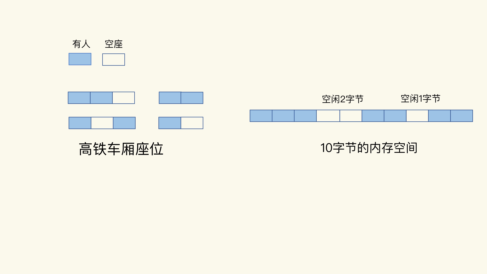

# 删除数据后，为什么内存占用率还是很高？

## 1. 概述

内存碎片的形成原因及其判定方法和清理方案。


在使用 Redis 时，我们经常会遇到这样一个问题：明明做了数据删除，数据量已经不大了，为什么使用 top 命令查看时，还会发现 Redis 占用了很多内存呢？

实际上，这是因为，**当数据删除后，Redis 释放的内存空间会由内存分配器管理，并不会立即返回给操作系统**。所以，操作系统仍然会记录着给 Redis 分配了大量内存。

但是，这往往会伴随一个潜在的风险点：**Redis 释放的内存空间可能并不是连续的，那么，这些不连续的内存空间很有可能处于一种闲置的状态**。这就会导致一个问题：虽然有空闲空间，Redis 却无法用来保存数据，不仅会减少 Redis 能够实际保存的数据量，还会降低 Redis 运行机器的成本回报率。


## 2. 内存碎片

### 什么是内存碎片

内存碎片即一个系统中所有不可用的空闲内存。



如上图所示，假设你和朋友出去玩需要买高铁票，正好该车厢还有3个位置够你们坐了，但是为了方便聊天大家都会选择连在一起的3个位置，所以不会选择这趟车。

类似的，申请内存时也是需要连续的类型，上图中虽然有3字节内存空闲，但是由于非连续导致无法使用。

> 这样就造成了内存的浪费

也就是内存碎片。


### 内存碎片是如何形成的？

内存碎片的形成有内因和外因两个层面的原因：

* 内因是操作系统的内存分配机制；
* 外因是 Redis 的负载特征。


**内因：内存分配器的分配策略**

Redis 可以使用 libc、jemalloc、tcmalloc 多种内存分配器来分配内存，默认使用 jemalloc。

jemalloc 的分配策略之一，是按照一系列固定的大小划分内存空间，例如 8 字节、16 字节、32 字节、48 字节，…, 2KB、4KB、8KB 等。当程序申请的内存最接近某个固定值时，jemalloc 会给它分配相应大小的空间。

> 这样的分配方式本身是为了减少分配次数。给一个大一点的空间，可能就刚好避免了下次在来申请内存。
>
> Redis 申请一个 20 字节的空间保存数据，jemalloc 就会分配 32 字节，此时，如果应用还要写入 10 字节的数据，Redis 就不用再向操作系统申请空间了，因为刚才分配的 32 字节已经够用了。


但是，如果 Redis 每次向分配器申请的内存空间大小不一样，这种分配方式就会有形成碎片的风险，而这正好来源于 Redis 的外因了。

**外因：键值对大小不一样和删改操作**

第一个外因是，Redis 申请内存空间分配时，本身就会有大小不一的空间需求。这是第一个外因。

内存分配器只能按固定大小分配内存，所以，分配的内存空间一般都会比申请的空间大一些，不会完全一致，这本身就会造成一定的碎片，降低内存空间存储效率。

第二个外因是，这些键值对会被修改和删除，这会导致空间的扩容和释放。具体来说，一方面，如果修改后的键值对变大或变小了，就需要占用额外的空间或者释放不用的空间。另一方面，删除的键值对就不再需要内存空间了，此时，就会把空间释放出来，形成空闲空间。

内存分配器策略是内因，而 Redis 的负载属于外因，包括了大小不一的键值对和键值对修改删除带来的内存空间变化。


### 如何判断是否有内存碎片？

Redis 是内存数据库，内存利用率的高低直接关系到 Redis 运行效率的高低。为了让用户能监控到实时的内存使用情况，Redis 自身提供了 INFO 命令，可以用来查询内存使用的详细信息，命令如下：

```sh
INFO memory
# Memory
used_memory:1073741736
used_memory_human:1024.00M
used_memory_rss:1997159792
used_memory_rss_human:1.86G
…
mem_fragmentation_ratio:1.86
```

这里有一个 mem_fragmentation_ratio 的指标，它表示的就是 Redis 当前的内存碎片率.

```sh
mem_fragmentation_ratio = used_memory_rss/ used_memory
```

used_memory_rss 是操作系统实际分配给 Redis 的物理内存空间，里面就包含了碎片；而 used_memory 是 Redis 为了保存数据实际申请使用的空间。


* mem_fragmentation_ratio 大于 1 但小于 1.5。这种情况是合理的。这是因为，刚才我介绍的那些因素是难以避免的。毕竟，内因的内存分配器是一定要使用的，分配策略都是通用的，不会轻易修改；而外因由 Redis 负载决定，也无法限制。所以，存在内存碎片也是正常的。
* mem_fragmentation_ratio 大于 1.5 。这表明内存碎片率已经超过了 50%。一般情况下，这个时候，我们就需要采取一些措施来降低内存碎片率了。


### 如何清理内存碎片？

