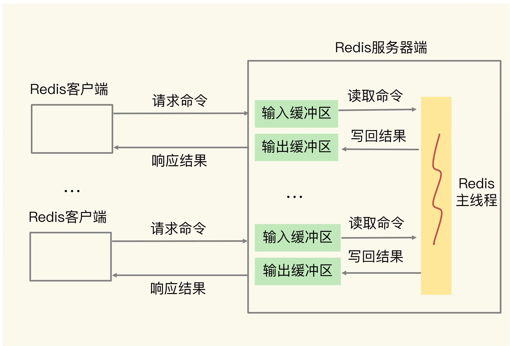
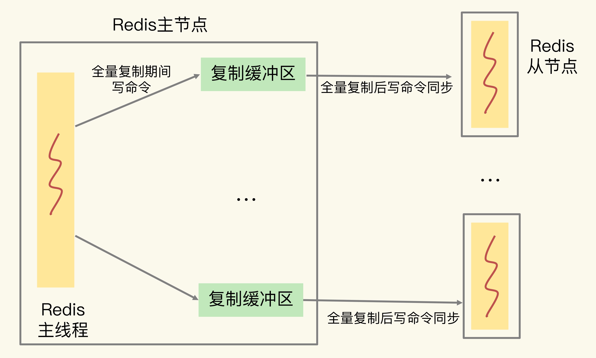
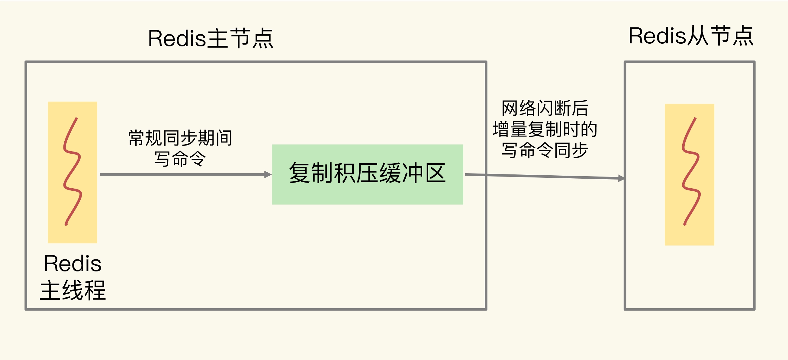

# 缓冲区：一个可能引发“惨案”的地方

## 1. 概述

**缓冲区的功能其实很简单，主要就是用一块内存空间来暂时存放命令数据，以免出现因为数据和命令的处理速度慢于发送速度而导致的数据丢失和性能问题。**

但因为缓冲区的内存空间有限，如果往里面写入数据的速度持续地大于从里面读取数据的速度，就会导致缓冲区需要越来越多的内存来暂存数据。当缓冲区占用的内存超出了设定的上限阈值时，就会出现缓冲区溢出。**如果发生了溢出，就会丢数据了**。

缓冲区在 Redis 中的一个主要应用场景，就是在客户端和服务器端之间进行通信时，用来暂存客户端发送的命令数据，或者是服务器端返回给客户端的数据结果。此外，缓冲区的另一个主要应用场景，是在主从节点间进行数据同步时，用来暂存主节点接收的写命令和数据。


## 2. 客户端输入和输出缓冲区

**为了避免客户端和服务器端的请求发送和处理速度不匹配**，服务器端给每个连接的客户端都设置了一个输入缓冲区和输出缓冲区，我们称之为**客户端输入缓冲区和输出缓冲区**。

输入缓冲区会先把客户端发送过来的命令暂存起来，Redis 主线程再从输入缓冲区中读取命令，进行处理。当 Redis 主线程处理完数据后，会把结果写入到输出缓冲区，再通过输出缓冲区返回给客户端，如下图所示：



### 如何应对输入缓冲区溢出？

因为输入缓冲区就是用来暂存客户端发送的请求命令的，所以可能导致溢出的情况主要是下面两种：

* 写入了 bigkey，比如一下子写入了多个百万级别的集合类型数据；
* 服务器端处理请求的速度过慢，例如，Redis 主线程出现了间歇性阻塞，无法及时处理正常发送的请求，导致客户端发送的请求在缓冲区越积越多。

要查看和服务器端相连的每个客户端对输入缓冲区的使用情况，我们可以**使用 CLIENT LIST 命令**：

```sh
CLIENT LIST
id=5 addr=127.0.0.1:50487 fd=9 name= age=4 idle=0 flags=N db=0 sub=0 psub=0 multi=-1 qbuf=26 qbuf-free=32742 obl=0 oll=0 omem=0 events=r cmd=client
```

返回信息比较多，我们只需要关注两类信息即可：

* 一类是与服务器端连接的客户端的信息
* 另一类是与输入缓冲区相关的三个参数
  * cmd，表示客户端最新执行的命令。这个例子中执行的是 CLIENT 命令。
  * qbuf，表示输入缓冲区已经使用的大小。这个例子中的 CLIENT 命令已使用了 26 字节大小的缓冲区。
  * qbuf-free，表示输入缓冲区尚未使用的大小。这个例子中的 CLIENT 命令还可以使用 32742 字节的缓冲区。qbuf 和 qbuf-free 的总和就是，Redis 服务器端当前为已连接的这个客户端分配的缓冲区总大小。这个例子中总共分配了 26 + 32742 = 32768 字节，也就是 32KB 的缓冲区。

通过以上信息就可以判断客户端输入缓冲区的内存占用情况了。如果 qbuf 很大，而同时 qbuf-free 很小，就需要引起注意了。

此时，客户端再写入大量命令的话，就会引起**客户端输入缓冲区溢出，Redis 的处理办法就是把客户端连接关闭**，结果就是业务程序无法进行数据存取了。

同时**这个缓冲区的内存占用也是算在 Redis 的 maxmemory  配置项里的**。

当多个客户端连接占用的内存总量，超过了 Redis 的 maxmemory 配置项时（例如 4GB），就会触发 Redis 进行数据淘汰，甚至可能触发 OOM。

我们可以从两个角度去考虑如何避免，**一是把缓冲区调大，二是从数据命令的发送和处理速度入手**。

**Redis 的客户端输入缓冲区大小的上限阈值，在代码中就设定为了 1GB**。且没有提供相关参数，也就是说，Redis 服务器端允许为每个客户端最多暂存 1GB 的命令和数据。

> 一方面 1 G 完全够用了，另一方面如果再调大，那留给 Redis 的内存就不多了。

所以只能从数据命令的发送和处理速度入手，也就是前面提到的**避免客户端写入 bigkey，以及避免 Redis 主线程阻塞**。


### 如何应对输出缓冲区溢出？

Redis 的输出缓冲区暂存的是 Redis 主线程要返回给客户端的数据。

> 返回数据既有简单且大小固定的 OK 响应（例如，执行 SET 命令）或报错信息，也有大小不固定的、包含具体数据的执行结果（例如，执行 HGET 命令）。

因此，Redis 为每个客户端设置的输出缓冲区也包括两部分：

* 一个大小为 16KB 的固定缓冲空间，用来暂存 OK 响应和出错信息；
* 一个可以动态增加的缓冲空间，用来暂存大小可变的响应结果。


**常见输出缓冲区溢出的情况：**

* 服务器端返回 bigkey 的大量结果；
* 执行了 MONITOR 命令；
* 缓冲区大小设置得不合理。

其中，bigkey 原本就会占用大量的内存空间，所以服务器端返回的结果包含 bigkey，必然会影响输出缓冲区。

**MONITOR**命令是用来监测 Redis 执行的。执行这个命令之后，就会持续输出监测到的各个命令操作，如下所示：

```sh
MONITOR
OK
1600617456.437129 [0 127.0.0.1:50487] "COMMAND"
1600617477.289667 [0 127.0.0.1:50487] "info" "memory"
```

MONITOR 的输出结果会持续占用输出缓冲区，并越占越多，最后的结果就是发生溢出。

建议：**MONITOR 命令主要用在调试环境中，不要在线上生产环境中持续使用 MONITOR。**

> 当然，如果在线上环境中偶尔使用 MONITOR 检查 Redis 的命令执行情况，是没问题的。

接下来，我们看下输出缓冲区大小设置的问题

我们可以通过`client-output-buffer-limit` 配置项，来设置缓冲区的大小。具体设置的内容包括两方面：

* 设置缓冲区大小的上限阈值；
* 设置输出缓冲区持续写入数据的数量上限阈值，和持续写入数据的时间的上限阈值。


Redis 客户端可以分类以下几类：

* 常规和 Redis 服务器端进行读写命令交互的普通客户端
* 订阅了 Redis 频道的订阅客户端
* 主从集群中，主节点上的从节点客户端
  * 即从节点连接到主节点，进行数据同步用的


当我们给普通客户端设置缓冲区大小时，通常可以在 Redis 配置文件中进行这样的设置：

```sh
client-output-buffer-limit normal 0 0 0
```

参数含义如下：

* normal 表示当前设置的是普通客户端，
* 第 1 个 0 设置的是缓冲区大小限制，
* 第 2 个 0 和第 3 个 0 分别表示缓冲区持续写入量限制和持续写入时间限制。


普通客户端用的阻塞式发送，即每发送完一个请求，会等到请求结果返回后，再发送下一个请求。在这种情况下，如果不是读取体量特别大的 bigkey，服务器端的输出缓冲区一般不会被阻塞的。

所以，我们通常把**普通客户端**的缓冲区大小限制，以及持续写入量限制、持续写入时间限制都设置为 0，也就是**不做限制**。

对于**订阅客户端**来说，一旦订阅的 Redis 频道有消息了，服务器端都会通过输出缓冲区把消息发给客户端。

> 如果频道消息较多的话，会占用较多的输出缓冲区空间。

此，我们会给订阅客户端设置缓冲区大小限制、缓冲区持续写入量限制，以及持续写入时间限制，可以在 Redis 配置文件中这样设置：

```sh
client-output-buffer-limit pubsub 8mb 2mb 60
```
参数含义如下：

* pubsub 参数表示当前是对订阅客户端进行设置；
* 8mb 表示输出缓冲区的大小上限为 8MB，一旦实际占用的缓冲区大小要超过 8MB，服务器端就会直接关闭客户端的连接；
* 2mb 和 60 表示，如果连续 60 秒内对输出缓冲区的写入量超过 2MB 的话，服务器端也会关闭客户端连接。


**输出缓冲区溢出应对方案**：

* 避免 bigkey 操作返回大量数据结果；
* 避免在线上环境中持续使用 MONITOR 命令。
* 使用 client-output-buffer-limit 设置合理的缓冲区大小上限，或是缓冲区连续写入时间和写入量上限。


## 3. 主从集群中的缓冲区

主从集群中，会进行数据复制，为了保证主从节点的数据一致，需要用到缓冲区。

> 这个缓冲区是不计算在Redis使用的总内存中的。
>
> 也就是说主从同步延迟，数据积压在主库上的从库输出缓冲区中，这个缓冲区内存占用变大，不会超过maxmemory导致淘汰数据。

### 复制缓冲区的溢出问题

在全量复制过程中，主节点在向从节点传输 RDB 文件的同时，会继续接收客户端发送的写命令请求。这些写命令就会先保存在复制缓冲区中，等 RDB 文件传输完成后，再发送给从节点去执行。主节点上会为每个从节点都维护一个**复制缓冲区**，来保证主从节点间的数据同步。

> 复制缓冲区用于记录全量复制过程中接收到的写命令请求。




所以，如果在全量复制时，从节点接收和加载 RDB 较慢，同时主节点接收到了大量的写命令，写命令在复制缓冲区中就会越积越多，最终导致溢出。

> 其实，主节点上的复制缓冲区，本质上也是一个用于和从节点连接的客户端（我们称之为从节点客户端），使用的输出缓冲区。

复制缓冲区一旦发生溢出，主节点也会直接关闭和从节点进行复制操作的连接，导致全量复制失败。

*那如何避免复制缓冲区发生溢出呢？*

* 一方面，我们可以**控制主节点保存的数据量大小**。把主节点的数据量控制在 2~4GB，这样可以让全量同步执行得更快些，避免复制缓冲区累积过多命令。

* 另一方面，我们可以**使用 client-output-buffer-limit 配置项**，来设置合理的复制缓冲区大小。设置的依据，就是主节点的数据量大小、主节点的写负载压力和主节点本身的内存大小。

在主节点执行如下命令：

```sh
config set client-output-buffer-limit slave 512mb 128mb 60
```

* slave 参数表明该配置项是针对复制缓冲区的。
* 512mb 代表将缓冲区大小的上限设置为 512MB；
* 128mb 和 60 代表的设置是，如果连续 60 秒内的写入量超过 128MB 的话，也会触发缓冲区溢出。

> 假设一条写命令数据是 1KB，那么，这个配置的复制缓冲区可以累积 512K 条（512MB/1KB = 512K）写命令。同时，主节点在全量复制期间，可以承受的写命令速率上限是 2000 条 /s（128MB/1KB/60 约等于 2000）。


在实际应用中设置复制缓冲区的大小时，可以**根据写命令数据的大小和应用的实际负载情况（也就是写命令速率），来粗略估计缓冲区中会累积的写命令数据量**；然后，再和所设置的复制缓冲区大小进行比较，判断设置的缓冲区大小是否足够支撑累积的写命令数据量。

由于**Redis 需要给每个从节点单独维护一个复制缓冲区**，所以我们还必须得控制和主节点连接的从节点个数，不要使用大规模的主从集群。


### 复制积压缓冲区的溢出问题

量复制时使用的缓冲区，这个缓冲区称为复制积压缓冲区。

主节点在把接收到的写命令同步给从节点时，同时会把这些写命令写入复制积压缓冲区。一旦从节点发生网络闪断，再次和主节点恢复连接后，从节点就会从复制积压缓冲区中，读取断连期间主节点接收到的写命令，进而进行增量同步，如下图所示：




首先，**复制积压缓冲区是一个大小有限的环形缓冲区**。当主节点把复制积压缓冲区写满后，会覆盖缓冲区中的旧命令数据。如果从节点还没有同步这些旧命令数据，就会造成主从节点间重新开始执行全量复制。

其次，为了应对复制积压缓冲区的溢出问题，我们可以调整复制积压缓冲区的大小，也就是设置 **repl_backlog_size** 这个参数的值。

**repl_backlog_size 缓冲空间的计算公式是：缓冲空间大小 = 主库写入命令速度 * 操作大小 - 主从库间网络传输命令速度 * 操作大小**。

> 在实际应用中，考虑到可能存在一些突发的请求压力，我们通常需要把这个缓冲空间扩大一倍。

假设主库每秒写入 2000 个操作，每个操作的大小为 2KB，网络每秒能传输 1000 个操作，那么，有 1000 个操作需要缓冲起来，这就至少需要 2MB 的缓冲空间。否则，新写的命令就会覆盖掉旧操作了。为了应对可能的突发压力，我们最终把 repl_backlog_size 设为 4MB。


## 4. 小结

* 普通客户端输入、输出缓冲区。

* 从节点客户端复制缓冲区、复制积压缓冲区。


输入缓冲区溢出：

* 写入了 bigkey，比如一下子写入了多个百万级别的集合类型数据；
* 服务器端处理请求的速度过慢，例如，Redis 主线程出现了间歇性阻塞，无法及时处理正常发送的请求，导致客户端发送的请求在缓冲区越积越多。

输出缓冲区溢出：

* 服务器端返回 bigkey 的大量结果；
* 执行了 MONITOR 命令；
* 缓冲区大小设置得不合理。

复制缓冲区溢出：

* 控制 Redis 主节点大小在 2~4 G 以降低 RDB 文件传输时间

  使用 client-output-buffer-limit 配置项设置合理的复制缓冲区大小

复制积压缓冲区溢出：

* repl_backlog_size 调整大小

从本质上看，缓冲区溢出，无非就是三个原因：命令数据发送过快过大；命令数据处理较慢；缓冲区空间过小。

