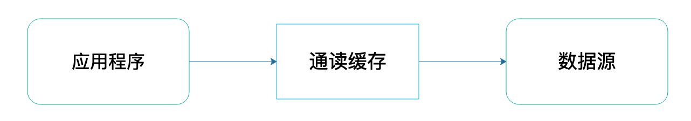
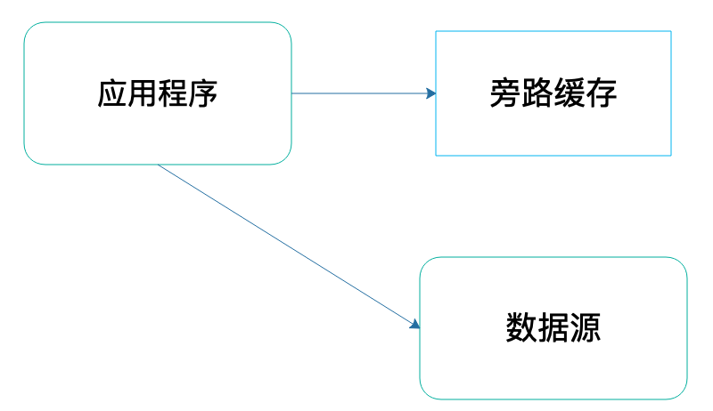

# 旁路缓存：Redis是如何工作的？

## 1. 概述

Redis 提供了高性能的数据存取功能，所以广泛应用在缓存场景中，既能有效地提升业务应用的响应速度，还可以避免把高并发大压力的请求发送到数据库层。

但是，如果 Redis 做缓存时出现了问题，比如说缓存失效，那么，大量请求就会直接积压到数据库层，必然会给数据库带来巨大的压力，很可能会导致数据库宕机或是故障。

所以，我们需要系统地掌握缓存的一系列内容，包括工作原理、替换策略、异常处理和扩展机制。具体来说，我们需要解决四个关键问题：

* Redis 缓存具体是怎么工作的？
* Redis 缓存如果满了，该怎么办？
* 为什么会有缓存一致性、缓存穿透、缓存雪崩、缓存击穿等异常，该如何应对？
* Redis 的内存毕竟有限，如果用快速的固态硬盘来保存数据，可以增加缓存的数据量，那么，Redis 缓存可以使用快速固态硬盘吗？


## 2. 缓存的特征

**一个系统中的不同层之间的访问速度不一样，所以我们才需要缓存**。

> 高速层和低速层之间的缓冲，以提升系统整体性能。


* CPU 10ns
* 内存 100ns
* 磁盘 10ms

> 可以看到 CPU、内存、磁盘之间访问速度差距特别大


```sh
CPU高速缓存https://blog.csdn.net/iteye_9421/article/details/82726596
https://www.cnblogs.com/xiaolincoding/p/13813074.html
```

为了防止高速的 CPU 被慢速的磁盘拖累，计算机系统中，默认有两种缓存：

* CPU 里面的末级缓存，即 LLC，用来缓存内存中的数据，避免每次从内存中存取数据；
* 内存中的高速页缓存，即 page cache，用来缓存磁盘中的数据，避免每次从磁盘中存取数据。

跟内存相比，LLC 的访问速度更快，而跟磁盘相比，内存的访问是更快的。所以，我们可以看出来缓存的**第一个特征：在一个层次化的系统中，缓存一定是一个快速子系统，数据存在缓存中时，能避免每次从慢速子系统中存取数据**。

> 对应用来说，Redis 就是快速子系统，而数据库就是慢速子系统了。
>
> 这也是为什么我们必须想尽办法让 Redis 提供高性能的访问，因为，如果访问速度很慢，Redis 作为缓存的价值就不大了。


另外 LLC 的大小是 MB 级别，page cache 的大小是 GB 级别，而磁盘的大小是 TB 级别。这其实包含了缓存的**第二个特征：缓存系统的容量大小总是小于后端慢速系统的，我们不可能把所有数据都放在缓存系统中**。

> 即：缓存的容量终究是有限的，缓存中的数据量也是有限的，肯定是没法时刻都满足访问需求的。所以，缓存和后端慢速系统之间，必然存在数据写回和再读取的交互过程。


Redis 本身是支持按一定规则淘汰数据的，相当于实现了缓存的数据淘汰，其实，这也是 Redis 适合用作缓存的一个重要原因。


## 3. Redis 缓存处理请求的两种情况

业务应用在访问数据时，会先查询 Redis 中是否保存了相应的数据。此时，根据数据是否存在缓存中，会有两种情况：

* **缓存命中**：Redis 中有相应数据，就直接读取 Redis，性能非常快。
* **缓存缺失**：Redis 中没有保存相应数据，就从后端数据库中读取数据，性能就会变慢。
  * 而且，一旦发生缓存缺失，为了让后续请求能从缓存中读取到数据，我们需要把缺失的数据写入 Redis，这个过程叫作缓存更新。缓存更新操作还会涉及到保证缓存和数据库之间的数据一致性问题。

根据以上两种情况，可以分析出使用 Redis 缓存时，我们基本有三个操作：

* 应用读取数据时，需要先读取 Redis；
* 发生缓存缺失时，需要从数据库读取数据；
* 发生缓存缺失时，还需要更新缓存。


## 4. Redis 作为旁路缓存的使用操作

一般说来，缓存可以分成两种，**通读（read-through缓存**和**旁路（cache-aside）缓存**。

**通读（read-through）缓存**，应用程序访问通读缓存获取数据的时候，如果通读缓存有应用程序需要的数据，那么就返回这个数据；如果没有，那么通读缓存就自己负责访问数据源，从数据源获取数据返回给应用程序，并将这个数据缓存在自己的缓存中。




**旁路（cache-aside）缓存**，应用程序访问旁路缓存获取数据的时候，如果旁路缓存中有应用程序需要的数据，那么就返回这个数据；如果没有，就返回空（null）。应用程序需要自己从数据源读取数据，然后将这个数据写入到旁路缓存中。



> 通读（read-through缓存和旁路（cache-aside）缓存主要差异点在于由谁来维护缓存数据。


我们也把 Redis 称为**旁路缓存**，也就是说，读取缓存、读取数据库和更新缓存的操作都需要在应用程序中来完成。

比如下面这样：

```go
String cacheKey = “productid_11010003”;
String cacheValue = redisCache.get(cacheKey)；
//缓存命中
if ( cacheValue != NULL)
   return cacheValue;
//缓存缺失
else
   cacheValue = getProductFromDB();
   redisCache.put(cacheValue)  //缓存更新
```


## 5. 缓存类型

按照 Redis 缓存是否接受写请求，我们可以把它分成**只读缓存**和**读写缓存**。


### 只读缓存

读请求：

* 1）从 Redis 中查询是否存在，存在直接返回
* 2）Redis 中不存在则去 DB 中查询并写入缓存

写请求：

* 1）更新数据库
* 2）删除 Redis 中的缓存数据
* 3）下次请求时发生缓存缺失后去 DB 中查询并写入缓存


只读缓存直接在数据库中更新数据的好处是，所有最新的数据都在数据库中，而数据库是提供数据可靠性保障的，这些数据不会有丢失的风险


### 读写缓存

对于读写缓存来说，除了读请求会发送到缓存进行处理（直接在缓存中查询数据是否存在)，所有的写请求也会发送到缓存，在缓存中直接对数据进行增删改操作。

> 得益于 Redis 的高性能访问特性，数据的增删改操作可以在缓存中快速完成，处理结果也会快速返回给业务应用，这就可以提升业务应用的响应速度。

但是在使用读写缓存时，最新的数据是在 Redis 中，而 Redis 是内存数据库，**一旦出现掉电或宕机，内存中的数据就会丢失**。这也就是说，应用的最新数据可能会丢失，给应用业务带来风险。

根据业务应用对数据可靠性和缓存性能的不同要求，我们会有**同步直写**和**异步写回**两种策略。其中，同步直写策略优先保证数据可靠性，而异步写回策略优先提供快速响应。

* 同步直写是指，写请求发给缓存的同时，也会发给后端数据库进行处理，等到缓存和数据库都写完数据，才给客户端返回。这样，即使缓存宕机或发生故障，最新的数据仍然保存在数据库中，这就提供了数据可靠性保证。
  * 需要等待数据库处理完所有的写请求，才能给应用返回结果，这就增加了缓存的响应延迟。

* 异步写回策略，则是优先考虑了响应延迟。此时，所有写请求都先在缓存中处理。等到这些增改的数据要被从缓存中淘汰出来时，缓存将它们写回后端数据库
  * 如果发生了掉电，还没有被写回数据库的这部分数据，就会有丢失的风险了。

> 同步直写和只读缓存比较像，同步直写更注重性能，只读缓存更关注数据一致性。
>
> 因为只读缓存再更新数据库后直接删除缓存，等下次触发缓存缺失时需要重新查询数据库获取最新数据，而同步直写同时更新数据库和缓存，少一次数据库查询但是可能出现一致性问题。

关于是选择只读缓存，还是读写缓存，主要看我们对写请求是否有加速的需求：

* 如果需要对写请求进行加速，我们选择读写缓存；
* 如果写请求很少，或者是只需要提升读请求的响应速度的话，我们选择只读缓存。


## 6. 小结

* 1） 缓存特征
  * 在分层系统中，数据暂存在快速子系统中有助于加速访问；
  * 缓存容量有限，缓存写满时，数据需要被淘汰
* 2）缓存种类
  * 通读缓存
  * 旁路缓存
* 3）Redis 缓存模式
  * 只读缓存
  * 读写缓存：还可以细分为同步直写和异步写回这两种模式。

