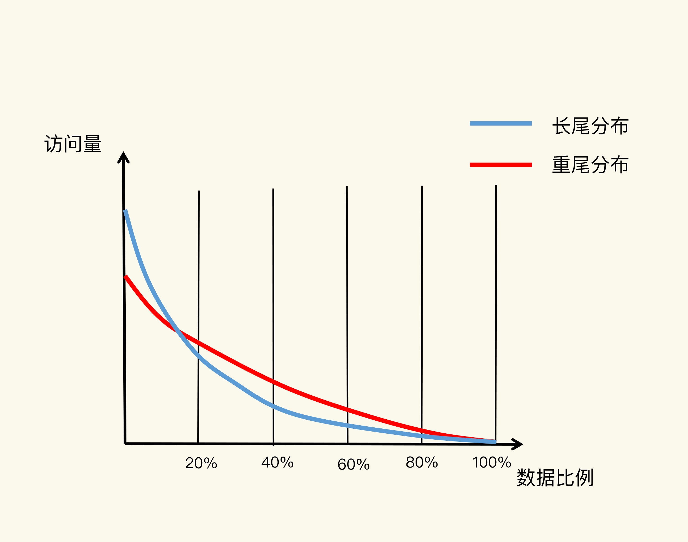
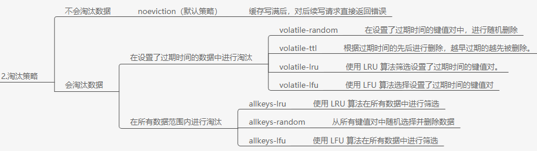

# 缓存淘汰策略

## 1. 概述

因为内存比硬盘贵，所以为了保证较高的性价比，缓存的空间容量必然要小于后端数据库的数据总量。

最终缓存空间会被写满，此时**缓存淘汰策略**就显得很关键了。

简单来说，数据淘汰机制包括两步：

* 第一，根据一定的策略，筛选出对应用访问来说“不重要”的数据；
* 第二，将这些数据从缓存中删除，为新来的数据腾出空间，


## 2. 设置多大的缓存容量合适？

按照`二八原理`，有 20% 的数据贡献了 80% 的访问，而剩余的数据虽然体量很大，但只贡献了 20% 的访问量。这 80% 的数据在访问量上就形成了一条长长的尾巴，我们也称为`长尾效应`。

但实际情况并不会严格按照 二八原理 来。

比如在商品促销时，热门商品的信息可能只占到总商品数据信息量的 5%，而这些商品信息承载的可能是超过 90% 的访问请求。

接下来，我们再看看数据访问局部性示意图中的红线。近年来，有些研究人员专门对互联网应用（例如视频播放网站）中，用户请求访问内容的分布情况做过分析，得到了这张图中的红线。在这条红线上，80% 的数据贡献的访问量，超过了传统的长尾效应中 80% 数据能贡献的访问量。原因在于，用户的个性化需求越来越多，在一个业务应用中，不同用户访问的内容可能差别很大，所以，用户请求的数据和它们贡献的访问量比例，不再具备长尾效应中的“八二原理”分布特征了。




实际容量需要根据**应用数据实际访问特征**和**成本开销**来综合考虑的。**一般建议把缓存容量设置为总数据量的 15% 到 30%，兼顾访问性能和内存空间开销**。

对于 Redis 来说，一旦确定了缓存最大容量，比如 4GB，你就可以使用下面这个命令来设定缓存的大小了：

```sh
CONFIG SET maxmemory 4gb
```


不过，**缓存被写满是不可避免的**,所以需要换成淘汰策略。

## 3. Redis 缓存有哪些淘汰策略？

edis 4.0 之前一共实现了 6 种内存淘汰策略，在 4.0 之后，又增加了 2 种策略。我们可以按照是否会进行数据淘汰把它们分成两类：

* 不进行数据淘汰的策略，只有 noeviction 这一种。
* 会进行淘汰的 7 种其他策略。

会进行淘汰的 7 种策略，我们可以再进一步根据淘汰候选数据集的范围把它们分成两类：

* 在设置了过期时间的数据中进行淘汰，包括 volatile-random、volatile-ttl、volatile-lru、volatile-lfu（Redis  4.0 后新增）四种。
* 在所有数据范围内进行淘汰，包括 allkeys-lru、allkeys-random、allkeys-lfu（Redis 4.0 后新增）三种。




> 在redis3.0之前，默认是 volatile-lru；在redis3.0之后（包括3.0），默认淘汰策略则是 noeviction。


## 4. LRU

LRU 算法的全称是 Least Recently Used，从名字上就可以看出，这是按照最近最少使用的原则来筛选数据，最不常用的数据会被筛选出来，而最近频繁使用的数据会留在缓存中。

通常的实现思路：

使用链表来存储数据，被访问到则移动到链表头部，删除时从链表尾部开始删除。

不过，LRU 算法在实际实现时，需要用链表管理所有的缓存数据，这会**带来额外的空间开销**。而且，当有数据被访问时，需要在链表上把该数据移动到 MRU 端，如果有大量数据被访问，就会带来很多链表移动操作，会很耗时，进而会降低 Redis 缓存性能。

所以，**在 Redis 中，LRU 算法被做了简化，以减轻数据淘汰对缓存性能的影响**。具体来说，Redis 默认会记录每个数据的最近一次访问的时间戳（由键值对数据结构 RedisObject 中的 lru 字段记录）。然后，Redis 在决定淘汰的数据时，第一次会随机选出 N 个数据，把它们作为一个候选集合。接下来，Redis 会比较这 N 个数据的 lru 字段，把 lru 字段值最小的数据从缓存中淘汰出去。

Redis 提供了一个配置参数 maxmemory-samples，这个参数就是 Redis 选出的数据个数 N。例如，我们执行如下命令，可以让 Redis 选出 100 个数据作为候选数据集：

```sh
CONFIG SET maxmemory-samples 100
```

当需要再次淘汰数据时，Redis 需要挑选数据进入第一次淘汰时创建的候选集合。这儿的挑选标准是：**能进入候选集合的数据的 lru 字段值必须小于候选集合中最小的 lru 值**。当有新数据进入候选数据集后，如果候选数据集中的数据个数达到了 maxmemory-samples，Redis 就把候选数据集中 lru 字段值最小的数据淘汰出去。

> 这样一来，Redis 缓存不用为所有的数据维护一个大链表，也不用在每次数据访问时都移动链表项，提升了缓存的性能。


## 5. 小结

Redis 缓存淘汰策略：

* 不淘汰 noeviction 。

* 在设置了过期时间的数据中进行淘汰，包括 volatile-random、volatile-ttl、volatile-lru、volatile-lfu（Redis  4.0 后新增）四种。
* 在所有数据范围内进行淘汰，包括 allkeys-lru、allkeys-random、allkeys-lfu（Redis 4.0 后新增）三种。

使用建议：

* **优先使用 allkeys-lru 策略**。这样，可以充分利用 LRU 这一经典缓存算法的优势，把最近最常访问的数据留在缓存中，提升应用的访问性能。如果你的业务数据中有明显的冷热数据区分，我建议你使用 allkeys-lru 策略。
* 如果业务应用中的数据访问频率相差不大，没有明显的冷热数据区分，建议使用 allkeys-random 策略，随机选择淘汰的数据就行。
* **如果你的业务中有置顶的需求**，比如置顶新闻、置顶视频，那么，可以使用 volatile-lru 策略，同时不给这些置顶数据设置过期时间。这样一来，这些需要置顶的数据一直不会被删除，而其他数据会在过期时根据 LRU 规则进行筛选。