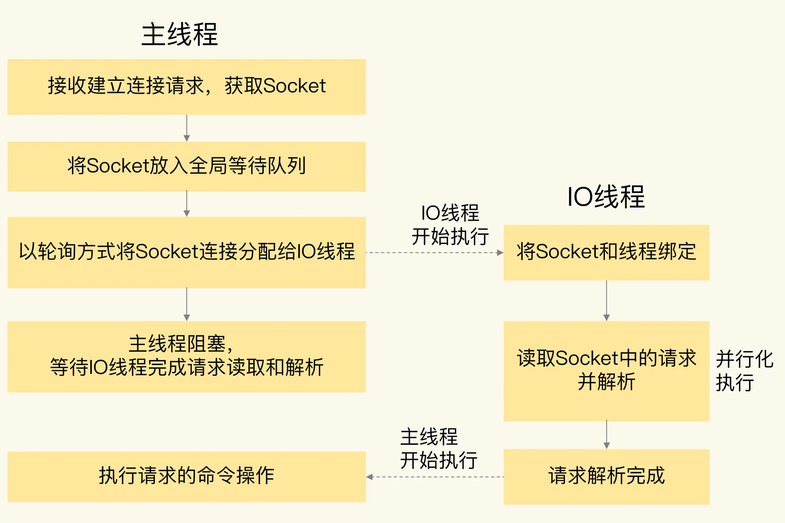
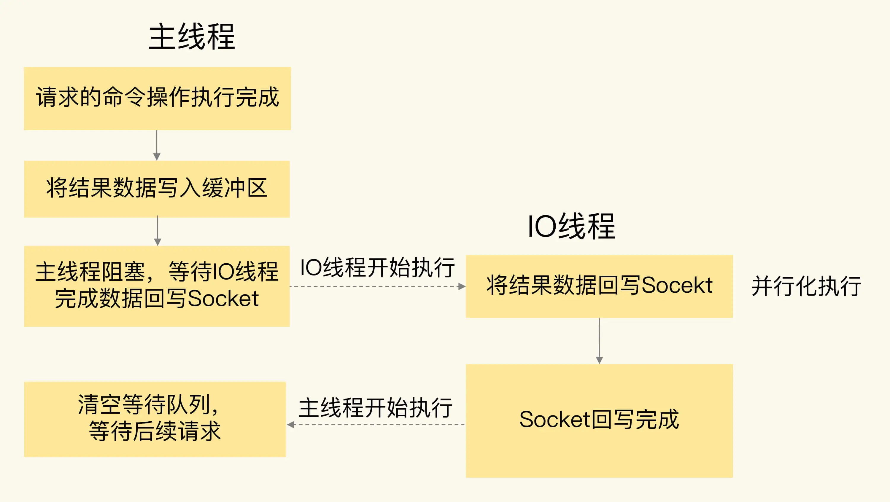

# Redis 6.0的新特性：多线程、客户端缓存与安全

## 1. 概述

 Redis 6.0 中的几个关键新特性，分别是面向网络处理的多 IO 线程、客户端缓存、细粒度的权限控制，以及 RESP 3 协议的使用。


## 2. 多线程

**在 Redis 6.0 中，非常受关注的第一个新特性就是多线程**。这是因为，Redis 一直被大家熟知的就是它的单线程架构，虽然有些命令操作可以用后台线程或子进程执行（比如数据删除、快照生成、AOF 重写），但是，从网络 IO 处理到实际的读写命令处理，都是由单个线程完成的。

随着网络硬件的性能提升，Redis 的性能瓶颈有时会出现在网络 IO 的处理上，也就是说，**单个主线程处理网络请求的速度跟不上底层网络硬件的速度**。


为了应对这个问题，一般有两种方法：

* 1）用用户态网络协议栈（例如 DPDK-Intel Data Plane Development Kit）取代内核网络协议栈，让网络请求的处理不用在内核里执行，直接在用户态完成处理就行。
* 2）采用多个 IO 线程来处理网络请求，提高网络请求处理的并行度。

Redis 6.0 就是采用的第二种方法。

但是，**Redis 的多 IO 线程只是用来处理网络请求的**，对于读写命令，Redis 仍然使用单线程来处理。


### 处理过程

为了方便理解，我们可以把主线程和多 IO 线程的协作分成四个阶段。

**阶段一：服务端和客户端建立 Socket 连接，并分配处理线程**

首先，主线程负责接收建立连接请求，并把建立好的 Socket 连接放入全局等待队列中。紧接着，主线程通过轮询方法把 Socket 连接分配给 IO 线程。

**阶段二：IO 线程读取并解析请求**

主线程一旦把 Socket 分配给 IO 线程，就会进入**阻塞**状态，等待 IO 线程完成客户端请求读取和解析。

> 因为有多个 IO 线程在并行处理，所以，这个过程很快就可以完成。

**阶段三：主线程执行请求操作**

等到 IO 线程解析完请求，主线程还是会以单线程的方式执行这些命令操作



**阶段四：IO 线程回写 Socket 和主线程清空全局队列**

当主线程执行完请求操作后，会把需要返回的结果写入缓冲区，然后，主线程会阻塞等待 IO 线程把这些结果回写到 Socket 中，并返回给客户端。

> 这里也是有多个线程在并发执行，所以回写 Socket 的速度也很快。

等到 IO 线程回写 Socket 完毕，主线程会清空全局队列，等待客户端的后续请求。




### 配置项

在 Redis 6.0 中，多线程机制默认是关闭的，如果需要使用多线程功能，需要在 redis.conf 中完成两个设置。

* 1）启用多线程，设置 `io-thread-do-reads` 配置项为 yes 。

```sh
io-threads-do-reads yes
```

* 2）设置线程个数，设置 `io-threads` 配置项。
  * **线程个数要小于 Redis 实例所在机器的 CPU 核个数**
  * 对于一个 8 核的机器来说，Redis 官方建议配置 6 个 IO 线程。

```sh
io-threads  6
```


## 3. 客户端缓存

Redis 6.0 新增了一个重要的特性，就是实现了服务端协助的客户端缓存功能，也称为跟踪（Tracking）功能。有了这个功能，业务应用中的 Redis 客户端就可以把读取的数据缓存在业务应用本地了，应用就可以直接在本地快速读取数据了。

> 将 Remote Cache 升级为 Local Cache


为了防止数据不一致，6.0 实现的 Tracking 功能实现了两种模式，来解决这个问题。

### 普通模式

在这个模式下，实例会在服务端记录客户端读取过的 key，并监测 key 是否有修改。一旦 key 的值发生变化，服务端会给客户端发送 invalidate 消息，通知客户端缓存失效了。


注意：服务端对于记录的 key 只会报告一次 invalidate 消息，也就是说，服务端在给客户端发送过一次 invalidate 消息后，如果 key 再被修改，也不会在发送  invalidate 消息了。只有当客户端再次执行读命令时，服务端才会再次监测被读取的 key，并在 key 修改时发送 invalidate 消息。

> 类似于 Zookeeper 的 watch 机制，都是一次性的，用掉后就需要重新触发。

我们可以通过执行下面的命令，打开或关闭普通模式下的 Tracking 功能。

```sh
CLIENT TRACKING ON|OFF
```


### 广播模式

在这个模式下，服务端会给客户端广播所有 key 的失效情况，不过，这样做了之后，如果 key 被频繁修改，服务端会发送大量的失效广播消息，这就会消耗大量的网络带宽资源。

所以，在实际应用时，我们会让客户端注册希望跟踪的 key 的前缀，当带有注册前缀的 key 被修改时，服务端会把失效消息广播给所有注册的客户端。

**和普通模式不同，在广播模式下，即使客户端还没有读取过 key，但只要它注册了要跟踪的 key，服务端都会把 key 失效消息通知给这个客户端。**

当我们在客户端执行下面的命令后，如果服务端更新了 `user:id:1003` 这个 key，那么，客户端就会收到 invalidate 消息。

```sh
CLIENT TRACKING ON BCAST PREFIX user
```

> 这种监测带有前缀的 key 的广播模式，和我们对 key 的命名规范非常匹配。我们在实际应用时，会给同一业务下的 key 设置相同的业务名前缀，所以，我们就可以非常方便地使用广播模式。


### 

不过，刚才介绍的普通模式和广播模式，需要客户端使用 RESP 3 协议。

对于使用 RESP 2 协议的客户端来说，就需要使用另一种模式，也就是重定向模式（redirect）。

在重定向模式下，想要获得失效消息通知的客户端，就需要执行订阅命令 SUBSCRIBE，专门订阅用于发送失效消息的频道` _redis_:invalidate`。同时，再使用另外一个客户端，执行 CLIENT TRACKING 命令，设置服务端将失效消息转发给使用 RESP 2 协议的客户端。


## 4. 细粒度权限控制

在 Redis 6.0 版本之前，要想实现实例的安全访问，只能通过设置密码来控制，例如，客户端连接实例前需要输入密码。

Redis 6.0 提供了更加细粒度的访问权限控制，这主要有两方面的体现。

**首先，6.0 版本支持创建不同用户来使用 Redis。另外，6.0 版本还支持以用户为粒度设置命令操作的访问权限。**

具体权限如下：

| 操作         | 作用                                     |
| ------------ | ---------------------------------------- |
| +<command>   | 将一个命令添加到用户可以调用的命令列表中 |
| -<command>   | 将一个命令从用户可以调用的命令列表中移除 |
| +@<categroy> | 将一类命令添加到用户可以调用的命令列表中 |
| -@<categroy> | 将一类命令从用户可以调用的命令列表中移除 |
| +@all        | 允许调用所有命令                         |
| -@all        | 禁止调用所有命令                         |

我们可以使用 ACL SETUSER 命令创建用户。例如，我们可以执行下面的命令，创建并启用一个用户 normaluser，把它的密码设置为“abc”：

```sh
ACL SETUSER normaluser on > abc
```

然后为用户添加权限

```sh
ACL SETUSER normaluser +@hash -@string
```

**除了设置某个命令或某类命令的访问控制权限，6.0 版本还支持以 key 为粒度设置访问权限。**

具体的做法是使用波浪号“~”和 key 的前缀来表示控制访问的 key。例如，我们执行下面命令，就可以设置用户 normaluser 只能对以`user`”为前缀的 key 进行命令操作：

```sh
ACL SETUSER normaluser ~user:* +@all
```


## 5. RESP 3 协议

Redis 6.0 实现了 RESP 3 通信协议，而之前都是使用的 RESP 2。

在 RESP 2 中，客户端和服务器端的通信内容都是以字节数组形式进行编码的，客户端需要根据操作的命令或是数据类型自行对传输的数据进行解码，增加了客户端开发复杂度。

而 RESP 3 直接支持多种数据类型的区分编码，包括空值、浮点数、布尔值、有序的字典集合、无序的集合等。

所谓区分编码，就是指直接通过不同的开头字符，区分不同的数据类型，这样一来，客户端就可以直接通过判断传递消息的开头字符，来实现数据转换操作了，**提升了客户端的效率**。除此之外，RESP 3 协议还可以支持客户端以普通模式和广播模式实现客户端缓存。


## 6. 小结

| 新特性       | 作用                                                         | 注意事项                                         | 适用场景                                 |
| ------------ | ------------------------------------------------------------ | ------------------------------------------------ | ---------------------------------------- |
| 多 IO 线程   | 使用多个IO线程并行读取网络请求、进行协议解析、回写Socket     | 多 IO 线程只负责处理网络请求，不执行命令操作     | 提升 Redis 吞吐量                        |
| 客户端缓存   | 1）使用普通模式，监测客户端读取的key的修改情况<br/>2）使用广播模式，将key的失效消息发送给所有客户端<br/>3）使用重定向模式，支持使用RESP 2协议的客户端<br/> | 普通模式和广播模式需要启用RESP 3协议接收失效消息 | 加速业务应用访问                         |
| 访问权限控制 | 区分不同用户，支持以用户和key为粒度设置某个或某类命令的调用权限 | /                                                | 支持多用户以不同权限访问Redis            |
| RESP 3 协议  | 使用不同开头字符表示多种数据类型，简化客户端开发复杂度       | /                                                | 高效支持不同数据类型使用，支持客户端缓存 |

