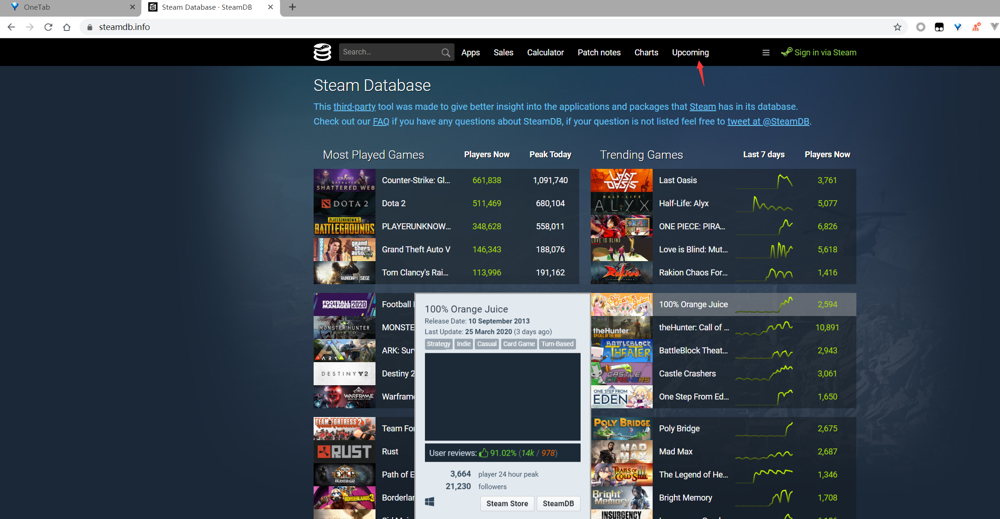
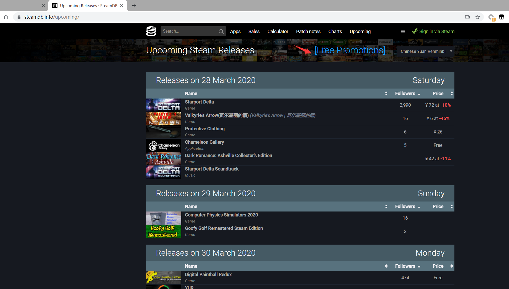
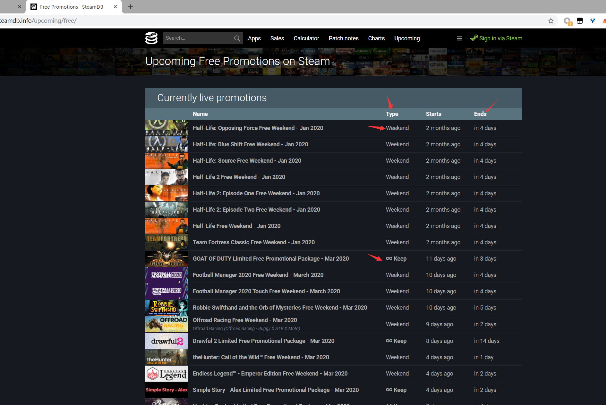

# 如何寻找steam上的免费促销游戏

steam上经常会出现一些游戏促销活动，甚至有-100%的折扣。不过大部分玩家在看到这个消息的时候活动可能已经结束了。今天介绍这个网站刚好可以解决这个问题。

## 网址

>  [https://steamdb.info](https://steamdb.info/) 

该网站收集了steam上的大部分游戏信息,其中也包括即将上架的游戏。

当然也有我们关注的促销游戏了。

## home page

首先打开这个网站,首页大概是长这个样子的

主页面大概是游戏的排行榜相关信息。

* 当前玩家最多的游戏
  * CSGO
  * DOTA2
  * PUBG

* 热门游戏
  * Last Oasis 最后的绿洲(生存类游戏)
  * Half-Life: Alyx V社的 半条命续作 
  * ONE PIECE: PIRATE WARRIORS 4 海贼无双4

游戏荒的时候可以在这上面看看有什么什么新出的游戏。

像我这样的白嫖玩家这时候就可以根据箭头提示切换到`upcoming`这一栏了。

## upcoming

大概是这样子的

这一栏主要是即将上架发行的游戏。

这里可以看看有没有你喜欢的游戏要上架了。

白嫖玩家这个时候直接根据箭头提示点击`Free Promotions`跳转到`免费促销`这栏。

## free Promotions

大概是长这个样子的

这里就是一些免费促销游戏的信息了。

其中`type`这一栏的话可以看成是促销类型吧。

`Weekend`表示周末可以免费玩，平常玩还是得收费的，不能添加到自己的游戏库里，只能体验一下游戏。

` ∞ Keep` 这个类型的就是可以添加到游戏库中了，相当于`100%`折扣,开始白嫖。

`Ends`很明显就是活动结束日期了，有了这个网站再也不用担心错过免费促销活动了。

