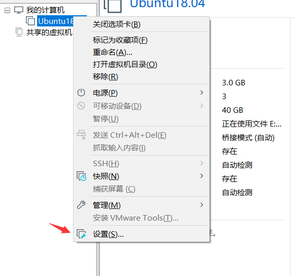
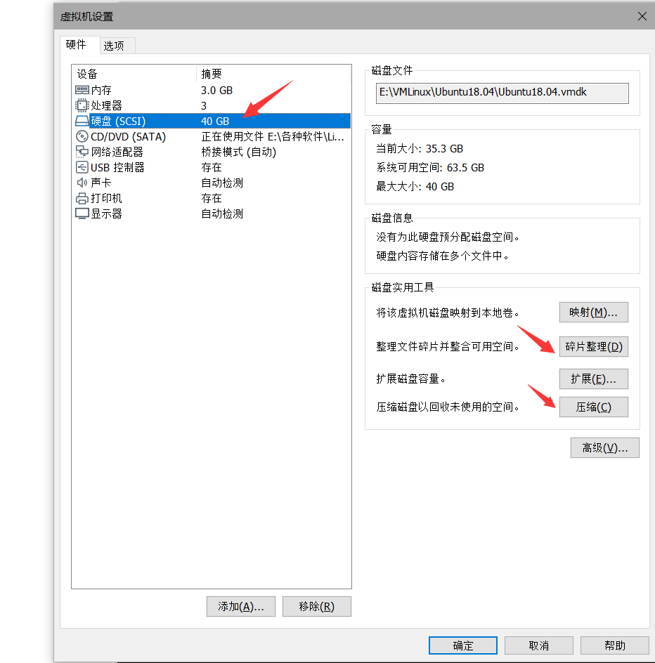
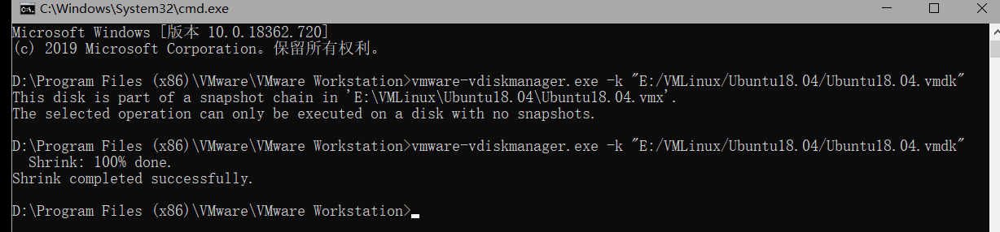
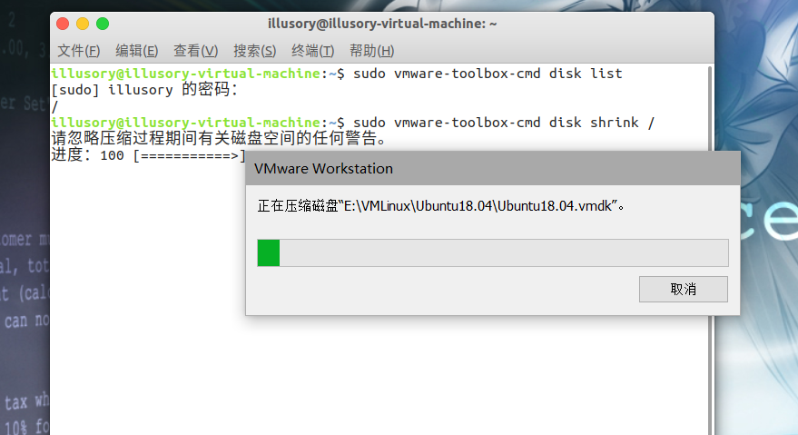

# 9.VMware虚拟机文件清理

## 1. 概述

在VMware里新建虚拟机向导时会让选择是否预分配虚拟磁盘空间（preallocate for virtual disk），如果选是，VMware将立即分配所有空间（Allocate all disk space now）；否则虚拟机文件将随着虚拟系统使用而增大 。

 如果选择了`不立即分配空间`，那使用了一阵子虚拟机后，你会就发现虚拟机文件`只增不减`，远大于虚拟系统中已使用的空间；还有虚拟系统运行速度逐渐下降，这样可能造成很多不便。 

 这时可以对虚拟磁盘/分区进行整理和压缩：整理（Defragment）在虚拟机设置中的虚拟磁盘设置可以找到，关键是保持磁盘数据的连续性，可以提高磁盘性能。`压缩（Shrink）功能可以收回虚拟系统中未使用的空间`，使虚拟机文件大小与虚拟系统已占用空间基本一致。 

## 2. 清理虚拟机

在清理压缩windows之前需要先把虚拟机中没用的文件清理一下。否则虚拟机中占用了大量空间，在怎么压缩都没有效果。

查看磁盘整天占用情况

```sh
df -h
```

查看当前目录占用情况

```sh
du -hs *
```

然后把没有用的文件删掉即可。

> 描述
> 有时候已经找到无用的文件，并且已经删除，但磁盘使用情况并没有得到改善，好像磁盘没有得到释放。
>
> 原因
> 当我们删除的文件被进程使用，并且没有关闭这个文件的句柄，那么linux内核还是不会释放这个文件的磁盘空间。
>
> 解决
> 查找占用删除文件的近程
>
> ```sh
> lsof -n | grep deleted
> ```
>
> 杀死近程
>
> ```sh
> kill -9 <进程号>
> ```


## 3. 压缩

### 1. 在VMware中的压缩选项






点击压缩和碎片整理。

这个方法使用之后文件夹的大小只是小了一点点。。没有什么太大的效果。


### 2. vmware-vdiskmanager

在VMware的安装目录中有一个叫`vmware-vdiskmanager`的执行文件，这个也可以用来清理压缩。

windows系统在cmd命令行中执行如下操作

```sh
vmware-vdiskmanager.exe -k ""虚拟文件目录""
```


例如

```sh
vmware-vdiskmanager.exe -k "E:/VMLinux/Ubuntu18.04/Ubuntu18.04.vmdk"
```

一定要指定到具体的`vmdk`文件，而且要选择不带`-s0`类似的后缀的。

这里需要注意的是只能压缩没有创建快照的文件。

```sh
The selected operation can only be executed on a disk with no snapshots.
```



### 3. 虚拟机中压缩

- 待优化的虚拟机必需能正常启动
- 待优化的虚拟机没有快照，假如有快照，必需先将快照全部删除
- 已在虚拟机中正常安装VMware Tools
- 待优化的虚拟机磁盘采用的是分割磁盘为多个文件的方式，且未预分配磁盘空间

主机系统上的磁盘可用空间必需大于虚拟机最大的一个虚拟磁盘分割文件，如我最大的虚拟磁盘分割文件为25G，则虚拟机所在的主机分区可用空间不能少于25G，因为在清理磁盘的时候，虚拟机会把当前优化的虚拟磁盘分割文件拷贝一份，并用0将已分配的空间填充拷贝的文件，然后优化，优化完之后将原分割文件给覆盖掉。

```sh
# 查看磁盘挂载列表
sudo vmware-toolbox-cmd disk list
# 清理挂载列表上的磁盘
sudo vmware-toolbox-cmd disk shrink /
```
这里同样需要把快照删掉才能执行命令 否则还是会提示静止压缩什么的。

>  以上命令必需在虚拟机中登录运行，而不能通过ssh等第三方工具运行，因为运行完上面的命令之后，VMware会将当前的虚拟机冻结，这样sshd会断掉，然后上述命令会被中断，而直接在虚拟机中运行则会被虚拟机接管，然后在主机VMware程序中继续执行磁盘整理 




## 4. 效果

最开始虚拟机文件夹占了大概46个G左右。

然后没有执行第二步 直接按照第三步压缩都执行了一次之后只降低了一点点，没有太多的效果。

然后按照第二步清理虚拟机文件后再次执行第三步压缩后磁盘占用缩小到了25G.效果也是十分明显的。

最后再说一下 压缩功能只是把虚拟机中已经释放的空间在宿主机释放而已，并不是每次都会有效果。如果虚拟机里面确实就占用了很大的空间那在怎么压缩也没用。