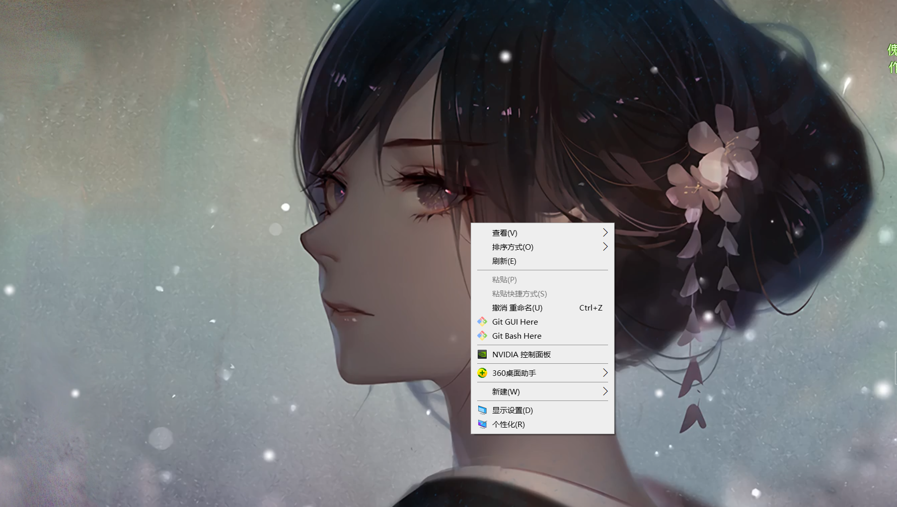

# 如何QQ截图时显示右键菜单

## 问题

正常情况下单击鼠标右键，然后按下QQ截图快捷键Ctrl+Alt+A的时候，右键菜单会自动消失，想要解决此问题的朋友可以参考下本文，或许对大家有所帮助。

 比如大家想截下面这个图

正常情况下先`单击鼠标右键` 出现如图的右键菜单，

然后`Ctrl+Alt+A`QQ截图的时候，右键菜单消失了... 

就算是拿出单身20年的手速同样无法捕捉到这个右键菜单。

那叫一个气呀。

## 解决办法

### 1. 方法一

第一个方法那就是直接按键盘`F12`旁边的`PrScr` 有的也显示为`屏幕`、`截屏幕`等。

没错 直接大力出奇迹，抓取整个屏幕,然后在截取到的图片中再次使用截图，这样曲线救国，也能达到目的。

### 2. 方法二

如果觉得方法一麻烦的话还有第二种方法可以解决这个问题。

1.直接在桌面按下`Alt+Ctrl`  **必须要先按Alt在按Ctrl**

2.然后点击`右键`出现`右键菜单`

3.接着在按下`A`键 截图

